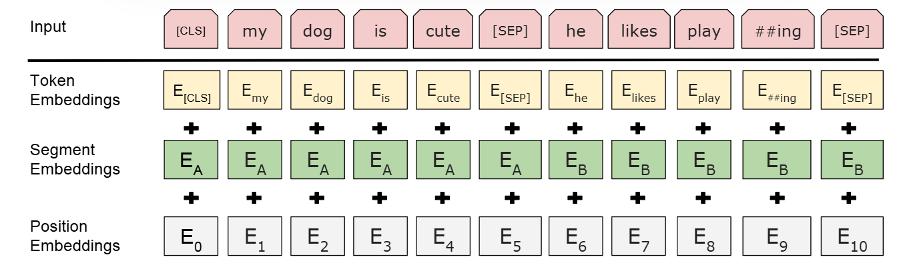

# 首先来了解一下基本流程

## 1.微调

在BERT的框架中，“微调”是指预训练之后，将已经**学习到通用语言表示的BERT模型**应用于**具体的下游自然语言处理（NLP）任务**的过程。

定义: 微调是BERT的第二个主要阶段。在这个阶段，BERT模型首先*使用在海量无标签文本上进行预训练所得到的参数*进行初始化。
过程:
添加任务层: 通常会在预训练好的BERT模型之上添加一个非常小的、仅包含少量参数的、针对特定任务的输出层。
端到端训练: 然后，使用特定下游任务的标记（labeled）数据集，对整个模型（包括预训练的BERT参数和新添加的任务层参数）进行端到端的**训练**。这意味着BERT模型的所有参数都会在训练过程中进行更新和调整。

目标: 目的是让通用的语言表示适应特定任务的需求，从而在诸如问答、文本分类、语言推理等任务上达到顶尖的性能，而无需为每个任务设计复杂的、特定的模型架构。

# 基本思想

## 1.输入

**Input**：这是 BERT 模型接收的原始文本序列。
图中显示了一个包含两个句子的示例：“my dog is cute” 和 “he likes playing”。
\[CLS] 标记: 位于序列的开头。这个特殊的标记用于获取整个输入序列的聚合表示，通常用于分类任务。

\[SEP] 标记: 用于分隔不同的句子。在这个例子中，它被用在第一个句子的末尾，然后是第二个句子，最后再跟一个 \[SEP] 标记。

WordPiece 标记: 输入文本被分割成 WordPiece 标记。例如，“playing” 被分解为 “play” 和 “##ing”。## 前缀表示这是一个**子词单元**。

## 2.mask策略

>BERT 在预训练过程中使用一种特殊的“掩码语言模型”（Masked Language Model, MLM）任务来学习深度的双向表示。然而，一个潜在的问题是，在预训练时会引入 [MASK] 标记，但在下游任务的微调（fine-tuning）阶段，这个 [MASK] 标记并不会出现，这可能导致预训练和微调之间的不匹配，从而影响模型在下游任务上的表现。
为了缓解这个问题，BERT 并没有总是将选中的词元（token）替换为 [MASK] 标记。相反，它采用了一种混合策略来处理被选中的 15% 的词元：

80% 的时间： 将选中的词元替换为 [MASK] 标记。这是最主要的掩码方式，让模型学会预测被遮蔽的词元。
例如：“my dog is hairy” → “my dog is [MASK]”

10% 的时间： 将选中的词元替换为一个随机选择的词元（从词汇表中）。这样做是为了让模型学习到输入词元的上下文表示，即使这个词元不是 [MASK]。这有助于模型关注词元的实际含义，而不是仅仅关注 [MASK] 标记。
例如：“my dog is hairy” → “my dog is apple” (假设 apple 是一个随机选择的词元)

10% 的时间： 保持选中的词元不变，不进行任何替换。这有助于模型在预训练阶段也能接触到真实的词元，从而更好地偏向于学习到实际观测到的词元。
例如：“my dog is hairy” → “my dog is hairy”

通过这种混合策略，BERT 迫使模型在每次输入时都要对所有词元（包括被掩盖、被随机替换或未改变的）保持其上下文表示。最后，模型会利用这些词元位置的最终隐藏向量来预测原始的词元 ID，并计算交叉熵损失。关于这种策略的变种和效果.