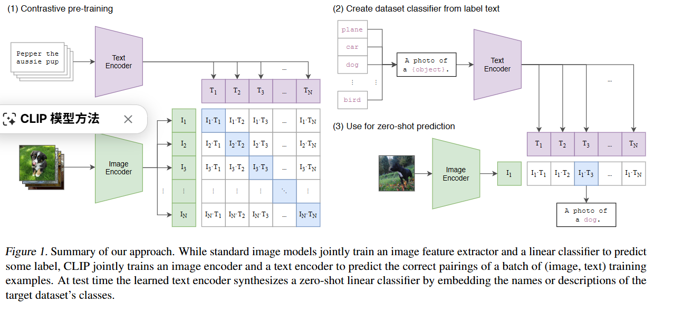
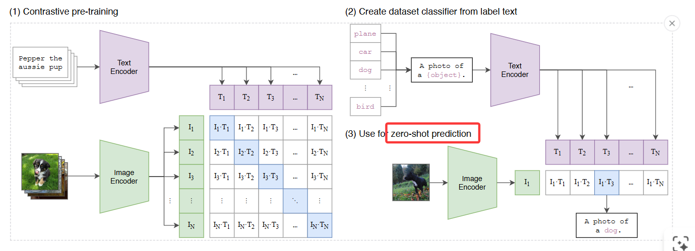
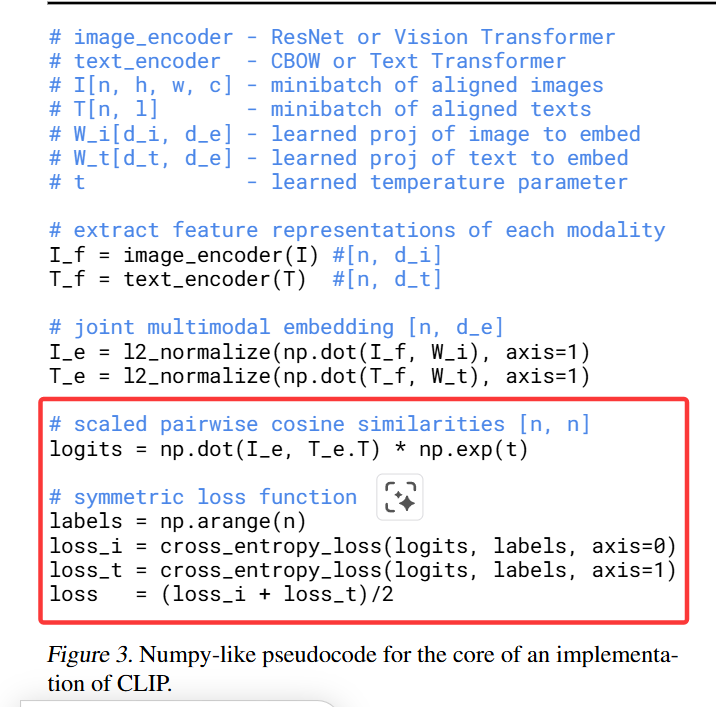
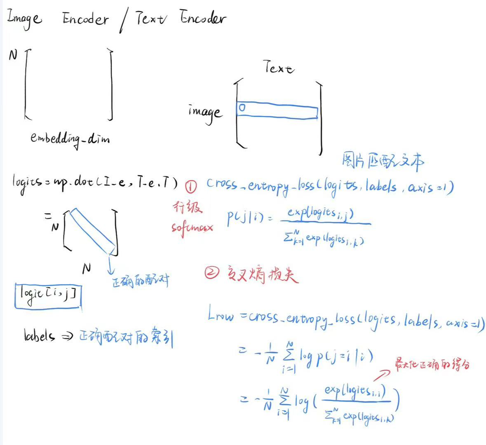

# 0.背景知识及优势
## 1）对比学习是什么？

核心思想是让模型学习区分相似和不相似的样本对

1. 给定一个批次（batch）的 N对（图像，文本）数据。
2. 模型包含一个图像编码器和一个文本编码器，分别生成图像和文本的特征表示。
3. 将这些表示映射到一个共享的多模态嵌入空间。在这个空间中，目标是**最大化批次内真正匹配的（图像，文本）对的相似度**（例如，通过计算余弦相似度），同时**最小化批次内所有不匹配的（图像，文本）对的相似度**。
4. 作者提到，这种方法在零样本（zero-shot）迁移任务上的效率比直接预测文本的方法提高了 4 倍 。

## 2）优势

- 传统方法：依赖于这种固定的、预设的分类体系，例如 ImageNet 中的 1000 个类别。*这限制了模型的泛化能力*，因为要识别新的概念，就必须重新标注数据并重新训练模型。
- 利用了**图像旁边存在的自然语言描述** 。这些文本本身就包含了丰富的视觉概念信息，并且不需要转换为预设的“1-of-N”格式.
- 这使得模型能够学习更广泛、更灵活的视觉概念，并且能够通过简单的文本提示（如“一张{类别名称}的照片”）来实现零样本迁移，而无需针对新任务进行任何数据标注或模型重新训练。

# 1.流程图

图中左侧矩阵，正样本就是对角线上的匹配数据对$n$,负样本就是$n^2-n$个

这张图展示了 CLIP（Contrastive Language-Image Pre-training）模型的核心思想和工作流程，主要分为两个阶段：**对比预训练 (Contrastive Pre-training)** 和 **零样本预测 (Zero-shot Prediction)**
1. 对比预训练
模型接收大量的（图像，文本）配对数据。模型包括两个主要的编码器，图像编码器接收图像并将其转换为一个向量表示，文本编码器接收文本并将其转换为一个向量表示

核心目标是让模型学会预测哪个图像与哪个文本描述是匹配的。在一个批次（batch）中，假设有N对（图像，文本）数据。模型会计算出 N x N 种可能的图像-文本相似度分数 其中对角线上的配对样本代表真实的配对，而非对角线上的代表错误的配对。

通过对比学习（Contrastive Learning），模型被训练来最大化真实配对的相似度，同时最小化错误配对的相似度。**这使得模型学习到一个统一的多模态嵌入空间，能够将语义相关的图像和文本映射到相近的位置**。

2. 零样本预测

在模型预训练完成后，我们可以用它来对新的、未见过的数据进行分类，而无需进一步的训练（即零样本迁移）

**文本生成分类器**
- 首先，定义一组潜在的类别（例如，“plane”, “car”, “dog”, “bird”）。
- 这些类别名称会通过一个模板（例如，“A photo of a {object}.”）进行加工，转化为更具描述性的文本（例如，“A photo of a dog.”）。
- 这些加工后的文本被送入文本编码器 (Text Encoder)，为每个类别生成一个文本嵌入向量 ($T_1, T_2, ..., T_N$​)。这些文本嵌入向量可以看作是模型创建的“零样本线性分类器”的权重。
**图像分类**
- 一张待分类的图像（例如，一只黑白相间的小狗）被送入图像编码器 (Image Encoder)，生成其图像嵌入向量 。
- 然后，计算该图像嵌入向量与所有预先生成的文本类别嵌入向量之间的相似度（例如，$I_1 \cdot T_1, I_1 \cdot T_2, I_1 \cdot T_3, ..., I_1 \cdot T_N$）。
- 模型预测得分最高的文本描述所对应的类别，即为该图像的预测结果。

总而言之，CLIP通过在一个大规模数据集上进行图像-文本配对的对比预训练，学习到一个强大的==视觉-语言关联能力==。在推理时，它能够利用这种能力，通过将图像和文本描述（通过自然语言模板生成）嵌入到同一空间，从而实现对新图像的零样本分类。

# 2.伪代码解析

## 1）输入

**图像编码器**: 它接收批次中的所有 N 张图像，并为每张图像生成一个向量表示（图像嵌入）。我们把这 N 个图像嵌入放在一个矩阵里，称为 $I_e$，它的形状大概是 ``[N, embedding_dim]``
**文本编码器**: 它接收批次中的所有 N 段文本，并为每段文本生成一个向量表示（文本嵌入）。我们把这 N 个文本嵌入放在一个矩阵里，称为 $T_e$，它的形状大概是`` [N, embedding_dim]``

## 2）损失函数设计

