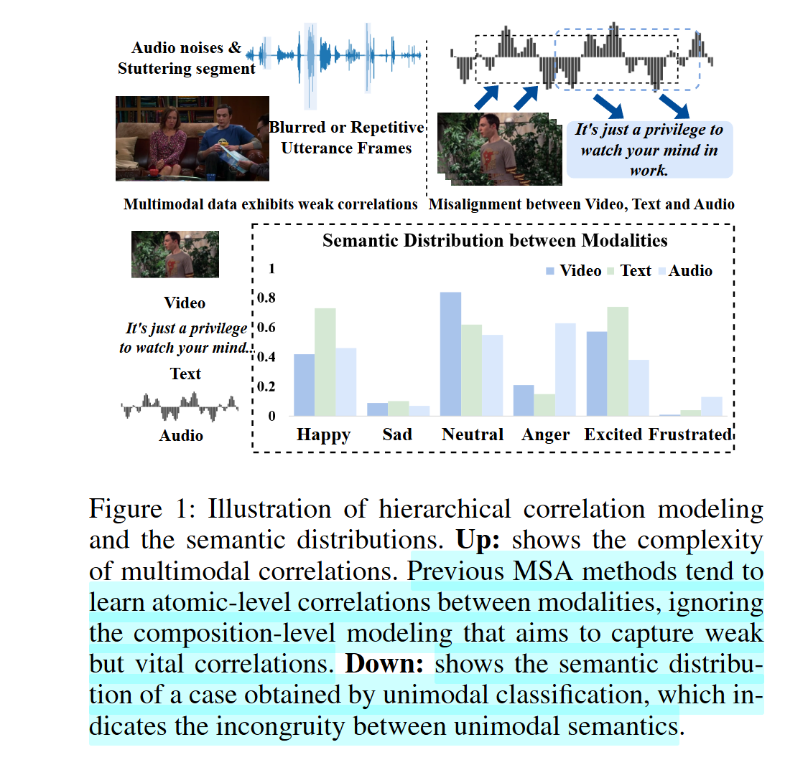
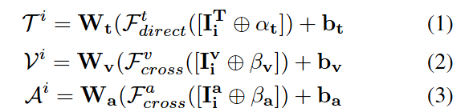
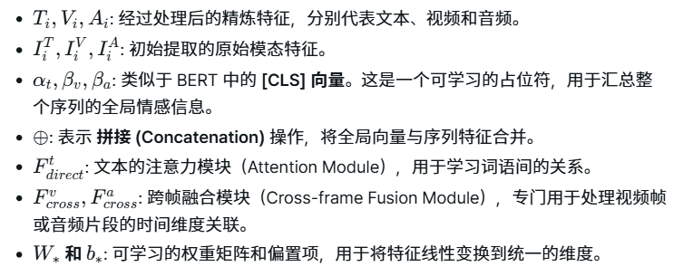
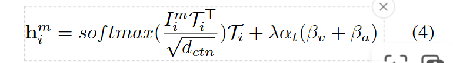
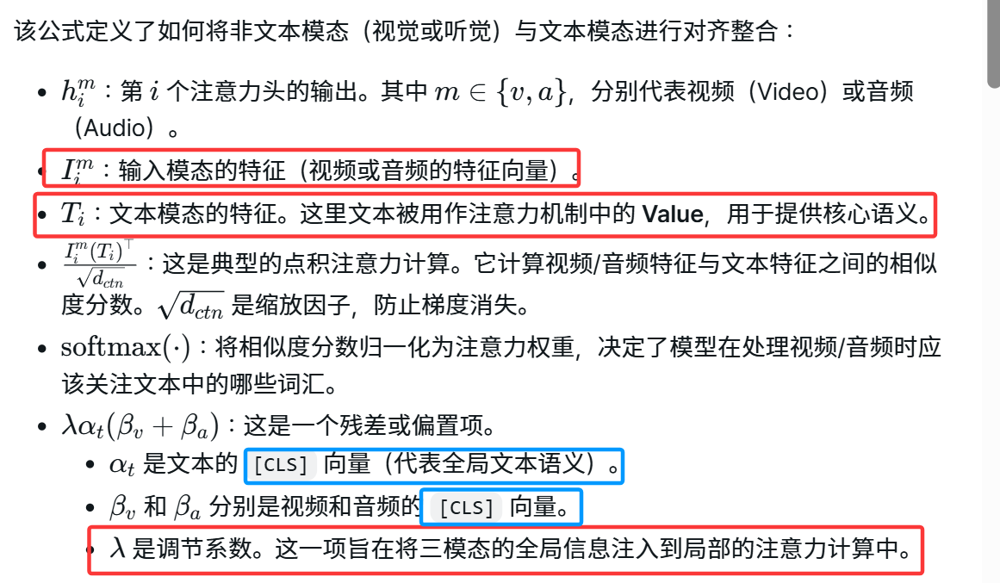
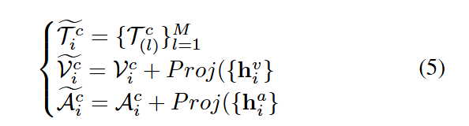
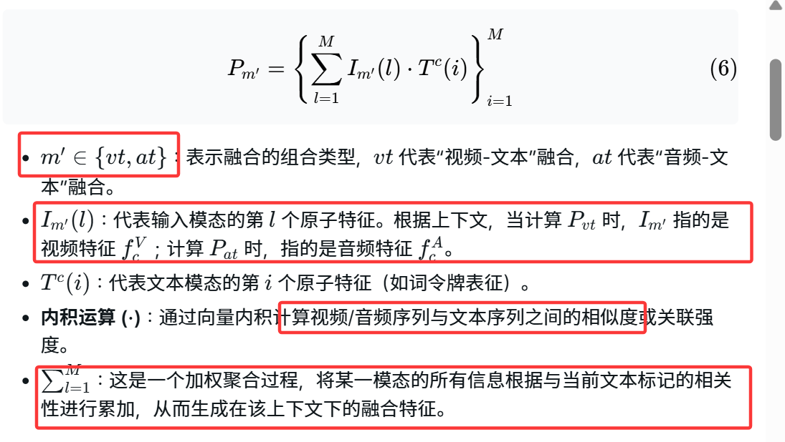
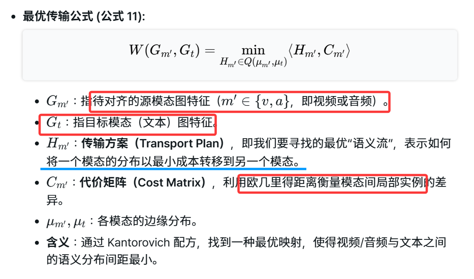
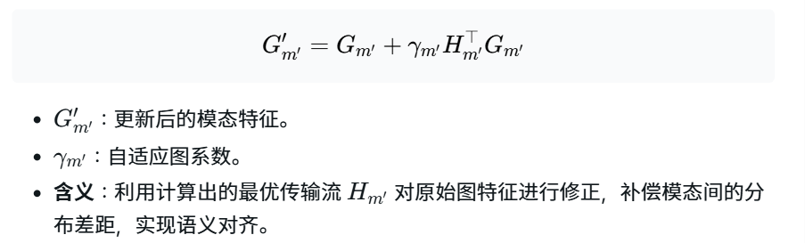
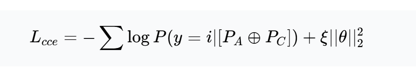

# 0.名词解释

1. **atomic-level features：原子级的强相关性特征**
   定义的颗粒度：在多模态数据中，“原子”指的是最小的可处理单位。
   文本：单个单词或标记（Token）。
   视频：单个视频帧（Frame）。
   音频：极短的时间片段（Segment）。
   独立性：原子级特征通常将这些单位视为独立的个体，而不考虑它们在时间或空间上的上下文结构
   强相关性：不同模态之间非常明显的同步关联性
2. **dual granularity emotion recognition：双粒度情感识别**
模型能够同时从不同层级的细节来捕捉和理解情感信息。
在数据处理中，“粒度”指代数据的细致程度。
- 细粒度（Fine-grained）：关注局部的、微观的特征。例如，视频中的单个帧、音频中的短片段、文本中的单个词汇（Tokens）。
- 粗粒度（Coarse-grained）：关注整体的、宏观的特征。例如，整个句子的语义、一段视频的完整动作序列或一段语音的语调起伏。
**为什么需要双粒度？**
克服单一局限：如果只看原子级（如单个词），可能会忽略上下文带来的讽刺或反转；如果只看整体，则可能丢失**决定情感的关键细节**（如一个转瞬即逝的眼神）。
处理不一致性：不同模态在不同粒度上的表现力不同。文本在词级别（原子级）情感明确，而视频可能需要通过一段序列（组合级）才能展现出完整的情绪。**双粒度建模能够通过多层级的比对，减少模态间的语义鸿沟。**
# 1.Abstract

1. HCMNet ：基于动态注意力机制的原子级相关性与基于拓扑图推理的组合级相关性 
    减缓了原子级和组合级模态间语义分布的不一致性
2. 原子级别的对比损失
    约束了跨模态的语义分布，以缓解原子级的不一致性
3. 图最优传输模块：聚合传输流
    约束组合级别语义特征分布，减少组合级的不一致性
# 2.introduction

## 现有的不足
*现有方法关键缺陷 研究的核心问题*

1. 仅考虑不同模态间的**原子级关联**，仅捕捉模态之间那些**明显的、强相关的特征关联** ，忽略了多模态数据中的**弱相关关系，也就是组合级的隐性关联**，这些关联不是通过单个词或帧表现出来的，而是通过一组元素的组合
2. 如图所示，由于多模态数据本质上具有复杂的相互关系，不同模态之间的情感表达往往是不对称的不一致的，不同模态在语义分布上存在差异 ，这导致了原子级和组合级视角下的情感一致性差 **单模态语义分布具有不一致性**

# Method

## 1.Feature Extraction
- text token：**pre-trained RoBERTa**
- video： **pre-trained efficientNet**+MLP
   建模帧重要性 捕捉帧间关系
-  audio：使用librosa工具包提取**Mel-spectrogram (梅尔频谱图)**
    Mel-spectrogram 是一种模拟人类听觉感知的音频特征。它将原始音频信号通过傅里叶变换转为频域信号，并映射到非线性的梅尔标度（Mel Scale）上，有效捕捉语音中的音调、共振峰等情感表达的关键信息
    - **音频被切分为多个时间片段，每个片段都会生成一个特征向量，最终形成一个随时间变化的序列**
    - 提取到的原始梅尔频谱特征通常维度较高且含有噪声，通过全连接层 ，模型可以将这些原始特征投影到一个特定的特征空间，调整其维度，使其更方便后续与文本和视频特征进行对齐和融合
## 2.Atomic-level Correlation Modeling

1. pre-trained CLIP+pretrained ESResNeXt 编码 **精炼单模态特征**
   CLIP类的核心能力是多模态对比学习，通过这一步的编码，模型能将文本、视觉和听觉的向量投影到一个**统一的语义空间中**。只有在这个空间里，模型才能通过 Dynamic Attention Reasoning 计算出“这个词语”和“这个视频帧”之间的相关性

2. 文本经过注意力模块，音频与视频使用跨帧融合模块处理

**为什么在视频和音频分支使用跨帧融合模块（Cross-frame Fusion），而文本分支使用 Direct 模块？**
    文本是**高度结构化的语义符号**。在 MSA 任务中，作者通常已经使用了 RoBERTa 和CLIP 的 Text Encoder。这些模型本身已经通过大量的 Self-Attention 处理了词与词之间的双向关系。
    Direct 模块（通常指标准的 Self-Attention）足以捕捉词语间的逻辑联系。文本的“上下文”更多是语义层面的跳转，不需要复杂的“帧间”平滑处理。  
    视频和音频是连续型信号。视频是由一系列相似度极高的静态图像（帧）组成的，音频则是连续的波形采样。**Cross-frame Fusion** 的核心在于“**时序平滑”与“动作捕获**”。它不仅要看当前的画面，还要关注画面之间的演变（例如：一个微笑的表情是从肌肉微动开始演化的）。

3. 动态注意力机制

**如何确立这里的QKV？**
Query (Q) = $I_i^m$（视频或音频特征）
代表视频或音频的特征，去询问：“在当前的视频画面或音频片段中，我应该寻找文本中的哪些信息？”
Key (K) =$T_i$(文本特征)
文本特征被用作“索引”。文本提供了可以被匹配的语义标签。在衡量每一帧视频/音频与**每一个单词之间的相似度。**
Value (V) = $T_i$ 
一旦确定了哪些单词重要（通过 Softmax 得到的权重），模型就从文本特征中提取这些信息。
 

- 在公式中，文本作为基准模态，其特征保持了原始的编码输出
- 动态注意力推理计算出跨模态注意力头，它们代表了视频/音频与文本之间动态关联的语义信息。
- 残差连接 (Residual Connection) 思想，这种加法操作将跨模态的“相关性增量”补充到原始模态特征中，既保留了模态特有信息，又融入了跨模态的辅助信息

##  3.Composition-level Correlation Modeling

### 拓扑图的建立

1. **text graph**
    节点 Vt 是由文本特征中的 Token（令牌/词元)组成的。
    使用预训练的 RoBERTa 提取每个单词的特征表示$I_i^T=[t1,t2,...tn]$
    利用 spaCy 提取单词之间的 Dependency Relations（依存关系），从而构建邻接矩阵
2. audio graph
    边是根据音频片段的**序列顺序**来连接的，由于音频是一个连续的时间序列，模型将每一个音频片段（节点）与其在时间轴上相邻的片段连接起来，从而捕捉声音随时间变化的规律
3. video graph
    节点对应于视频序列中的**独立帧或经过处理的视频片段特征**
    计算两个视频语句（Utterance）特征向量之间的余弦相似度，若大于阈值则连接
### 最优传输

**图特征更新**

**融合模块**
 
### 损失函数设计
1. 分类损失

- $P_A P_C$表示原子级特征与组合级特征的融合
- 在给定融合特征的情况下，样本属于情感类别i的概率
2. 此前的$L_{acl}$ **原子级对比学习损失**,目的是让相同情感的模态特征在空间上更接近，不同情感的更疏远
3. 由于模型包含两种截然不同的损失（对比损失和分类损失），它们的数值量级可能相差很大。为了平衡两者，作者设计了自适应权重