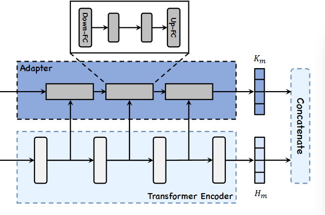
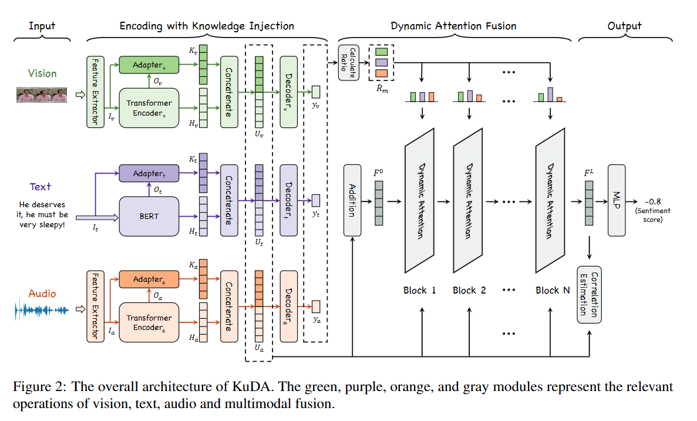
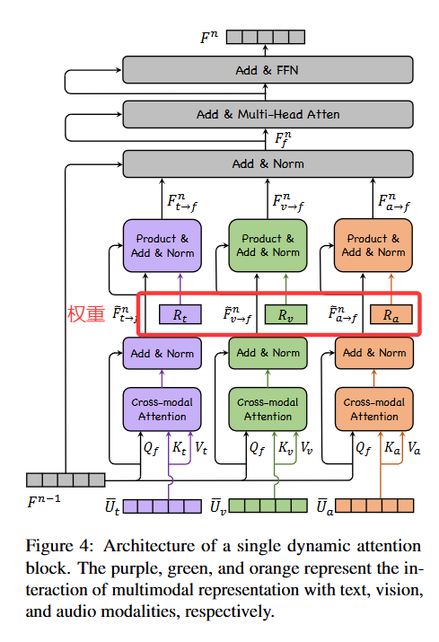
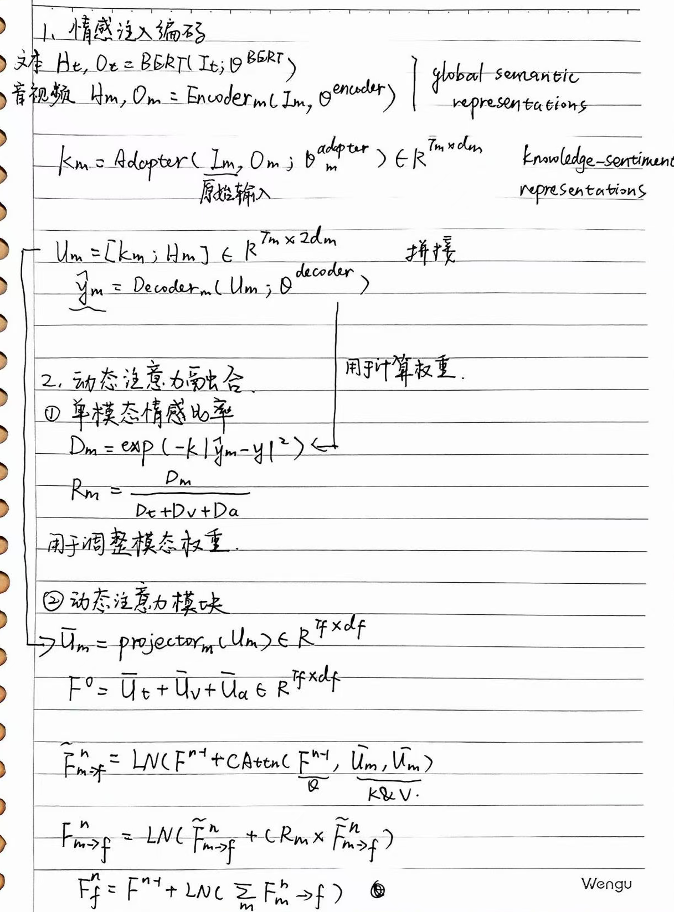
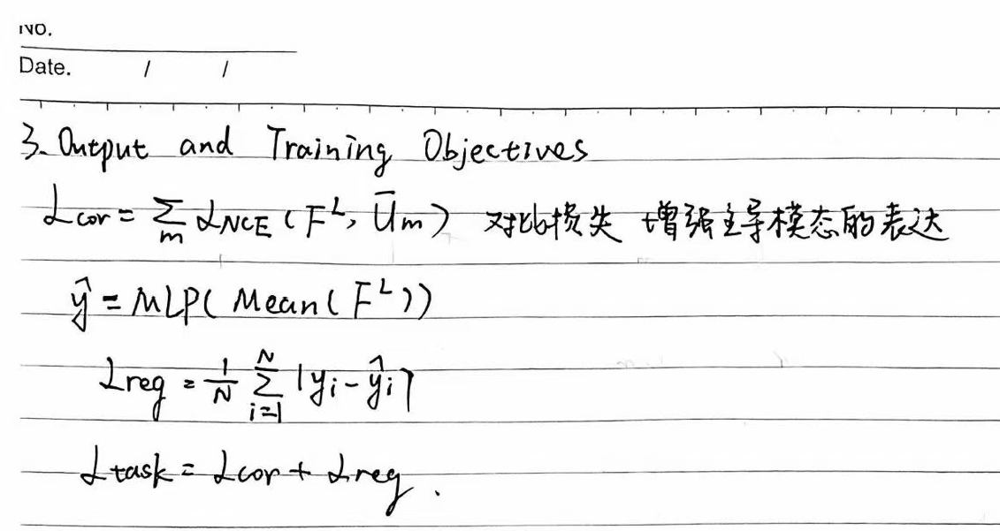

# 1.背景

1. 先前的方法均等对待每个模态的贡献或将文本作为主要模态，忽略了每种模态成为主导的可能
# 2.相关工作

1. 三元对称（两两模态双向关系建模）与基于文本为中心的方法[[KuDA#*亮点]]
2. 对比学习
# 3.方法论

## 1.Encoder and Adapter

- Transformer Encoder 是普通的 encoder 堆叠（**多层自注意力 + 前馈网络**），它输入原始模态特征，每层输出传递到下一层，最终得到**全局语义表示 Hm**（通常取最后一层或汇聚后的输出）
    - Hm->global sentic representation 全局语义表示，模态的通用信息 ，不专门针对情感知识注入。
- Adapter 被“插接”到 Transformer 的中间层（图中箭头指出 Adapter 接收自 Transformer 的若干中间层输出作为输入），**注入或增强特定知识**
    - 输出为Km，知识情感表示
    通过把 Adapter 接到多个（但不是全部）Transformer 层，**模型能在不同深度引入情感线索**
# 2.overview
 
 

# 3. Dynamic AttentionFusion

 
 

# \*亮点

1. Introduction中的关于三元对称法与以文本主导方法的概述
> when the dominant modality is not fixed, the ternary
 symmetric-based methods cannot effectively adapt
 to the situation where any modality is dominant
 because they do not consider the differences of im-
 portance between modalities. The text center-based
 methods statically set text as the dominant modal-
 ity, and when other modalities are dominant, the
 model’s attention is distracted by the text.

因此，当主导模态不固定时，基于三元对称的方法无法有效地适应任何模态占主导地位的情况，因为分不清各个模态重要性的区别。基于文本中心的方法静态地将文本设为主导模态，当其他模态占优时，模型的注意力会被文本分散。
2. Limitation ：
情感注入后的预测打分用于计算权重，此处一旦引入噪声，会影响后面的计算分析
建议和可行的改进方向（供研究或工程实现参考）：
 - 联合微调（end-to-end fine-tuning）：把 adapter/decoder 从冻结改为可微调，或采用带正则化的联合训练，以减少两阶段训练造成的误差孤岛和传播。
 - 对单模预测用对比学习或自监督增强其鲁棒性：在知识注入预训练阶段加入噪声对比训练，提升单模情感预测在噪声下的稳定性。