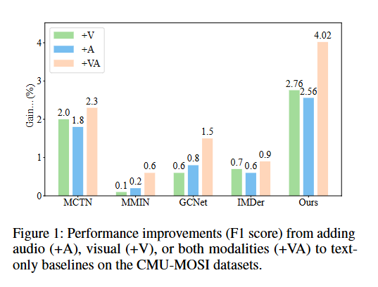

# 1.背景

 
 1. 将音频和视觉模态整合到一个仅文本的基线模型中，所带来的性能提升有限，这表明模态交互可能涉及干扰或竞争，而非直接的合作
 2. 模态间的合作与竞争是动态的，而其中的内在联系还值得研究
 3. 主导模态通常会掩盖非主导模态，导致次优结果或结果提升有限

# 2.相关工作

🌟模态竞争
现有方法大多通过非直接信号例如梯度范数或损失来约束主导模态对较弱模态的压制，缺乏对每个模态贡献的原则性量化

# 3.Method

1. 针对主导模态会掩盖较弱模态，导致阻碍有效融合并降低整体性能，✅**采用原型引导的模态内的对齐校准**
2. 针对模态间固有的分布的异质性，✅**采用跨膜态熵最优传输对齐**

## 具体细节

>The alignment objective is to minimize the transportation cost between the two distributions

