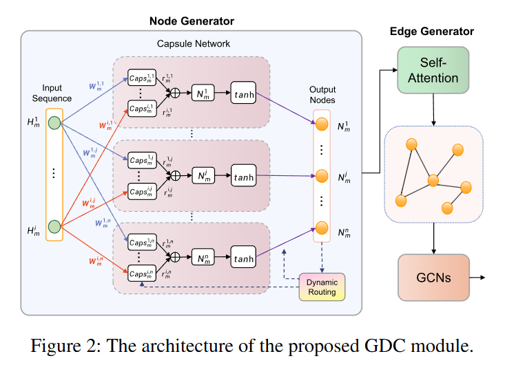
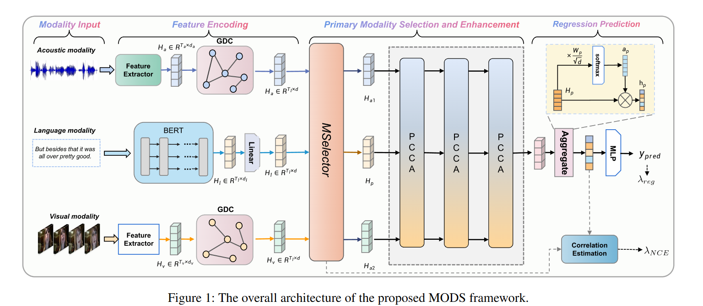

# 1.背景

- 现有方法通常采用固定的主模态策略最大化主导模态优势，但未能适应不同样本间模态重要性的动态变化
- 🫠强制优先考虑语言模态而导致忽略其他模态的关键感情线索
- 🫠非语言模态信息密度低，包含重复不相关特征，直接作为主模态可能造成噪声干扰

# 2.架构

1. ✅GDS（基于图的动态压缩器）：解决非语言模态的序列冗余与噪声问题
2. ✅MS-elector（样本自适应模块）：通过动态确定每个输入样本的最佳主模态，来超越传统的单模态主导范式
3. ✅PCCA（以主要模态为中心的跨模态注意力机制）：促进模态间交互与主要模态增强
# 3.具体

## 1.GDC
 
 - 非语言模态第i帧的维度是m，输出维度是n
 - 因此首先计算caps，即每个帧对每个节点的胶囊向量（贡献），一个帧的表示一个向量
 - 每个节点每个胶囊向量乘路由系数r，相加形成最后的节点
 - 循环三轮，更新权重标准b
