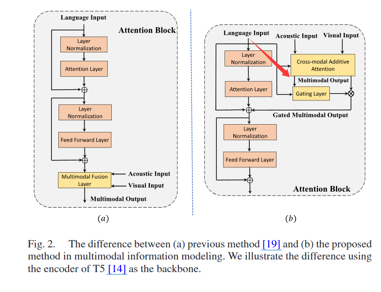
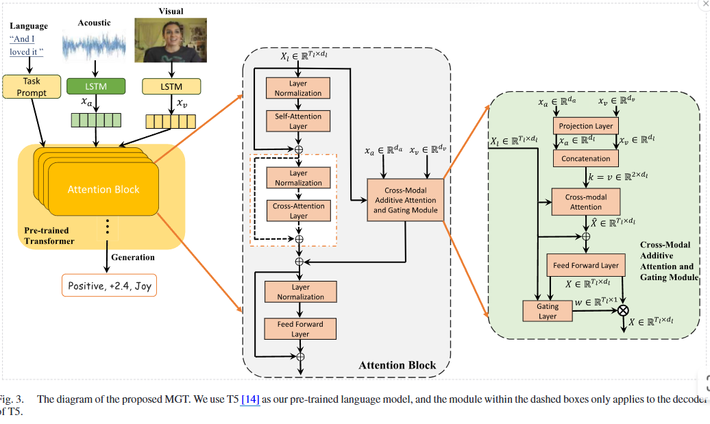

# 1.提炼重要贡献

1.cross-model margin and matching losses
跨模态边界损失与匹配损失
>to align the distributions of various modalities and
 simultaneously retain modality-specific information, which to some
 extent address the shortcoming of contrastive learning loss. 

- 解决跨模态对齐问题 
- 保留各个模态的独特信息 
- 一定程度上解决对比学习损失的短板

2.并行多模态流模块 带有门控机制 
> a parallel multimodal flow module with a gating
 mechanism that dynamically controls the influence of nonver-
 bal modalities based on their estimated discriminative power.

- 基于非语言模态的判别能力动态控制它们的影响

## 总结

**带有门控机制的并行的多模态流模块**
- 防止非语言模态的噪声模注入到模型中
- 非语言模态作为辅助模态帮助模型更好的理解人类多模态的语言
 
# 2.痛点+涉及的方面

1. “注意力+融合模块”这种顺序结构，融合模块永远被考虑其中，难以避免非语言模态的噪音与无辨别能力的信息融入到模型中
2. 现存的以语言模型为主导的多模态方法不关注非语言模态的判别能力
3. 现有的方法通常直接将非语言和语言模态信息在输入层与融合层进行连接
4. 以文本语言为主导的多模态分析模型
5. **对比学习** 对齐多模态
# 3.写作借鉴

## related work

MSA，aiming to effectively integrate information from acoustic,
spoken language, and visual expressions for the analysis of
sentiment intensity, opinion tendency, and emotional state, is
a promising area of multimodal machine learning and has great
application potential.
旨在有效整合来自声学、口语和视觉表达的信息，用于分析情感强度、观点倾向和情绪状态，这是一个有前景的多模态机器学习领域，并具有巨大的应用潜力。

### MSA

- 提出有效的方法来建模跨模态交互
- 应用注意力机制的融合方法
    - 情感知识增强注意力融合网络
- 噪声模态问题
    - 门控机制
    - T2FN 时序张量融合网络
- 减小模态间隙问题
    - 对抗表示的图融合：对抗学习学习一个共同的特征空间，减小特征空间中模态间的分布差异
    - MISA 子空间特征 减小模态间的分布差距 解耦单模态特征
    - 通用与私有编码器
- 对比学习 缓解多模态之间的异质性
### Fine-Tuning PLMs With Multimodal Data

- 得益于BERT的发展
- 提示学习
- 顺序多模态融合层
# 4.method

## 架构创新

以下做简要说明：
- 视觉与听觉信息通过**LSTM**进行压缩 Tm->1\*dm
- 并行的跨模态加性的注意力机制
    - 听觉与视觉信息作为key和value，其表示方式为压缩后的视觉与听觉信息(xm)的拼接
    - 文本特征信息Xl作为query
    - 经过注意力机制得到X‘
- X=FFN（X’+Xl）表示融合后的信息
- 门控机制
    - sigmoid函数 计算源文本向量Xl与融合向量X的相似性与影响力，表示为权重w
    - 更新融合向量X=X\*w，其中的，w 可以被理解为“X 与每个语言 token（Xl 对应时间步）之间的相容性/有用性” 的一种可学习、软化的度量
- 最终的以文本为主导的向量Xl=Xl+X
## loss创新
### match loss

把声学、视觉的特征分布，对齐到语言模态的分布（对齐均值 + 方差），只改非语言模态，语言不动梯度
不是样本对对齐，而是整个批次的统计量对齐
- Tm 也就是时间步，被压缩至1
- 以batch为单位，计算每个batch的均值与方差
- 同个batch中，文本与视觉听觉的均值与方差的差值越小越好

### margin loss
以语言为锚点（anchor，让 同一样本的视觉 / 声学（正样本）比批次里其他样本的视觉 / 声学（负样本）** 更相似，且差出一个margin γ，只更新非语言模态
positive为同样本非语言归一化向量
negative为本batch中其余样本的取均值