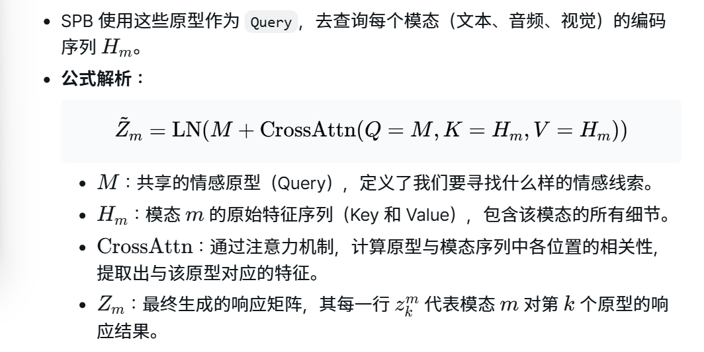
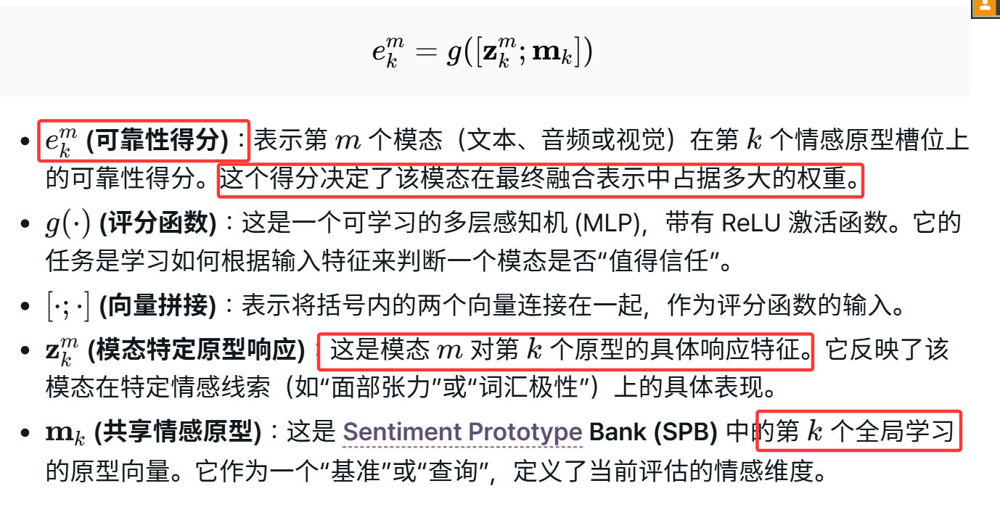
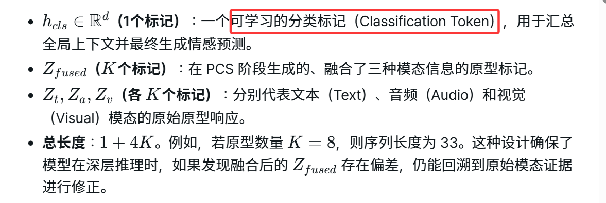
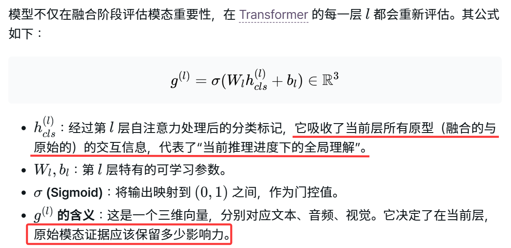
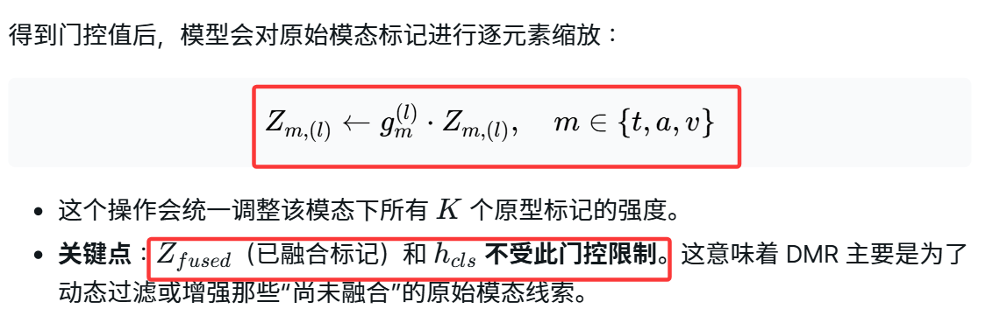
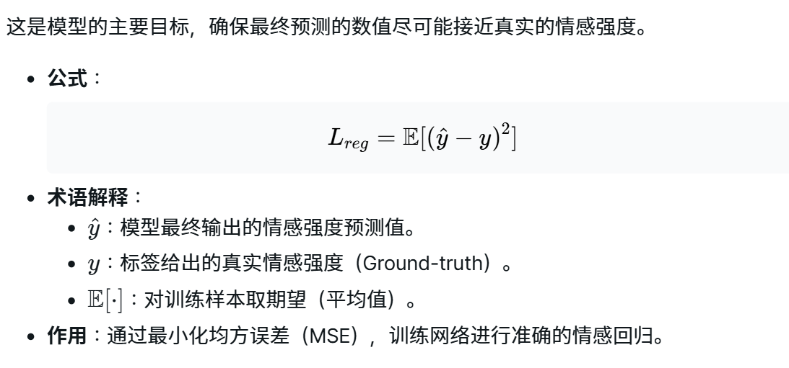
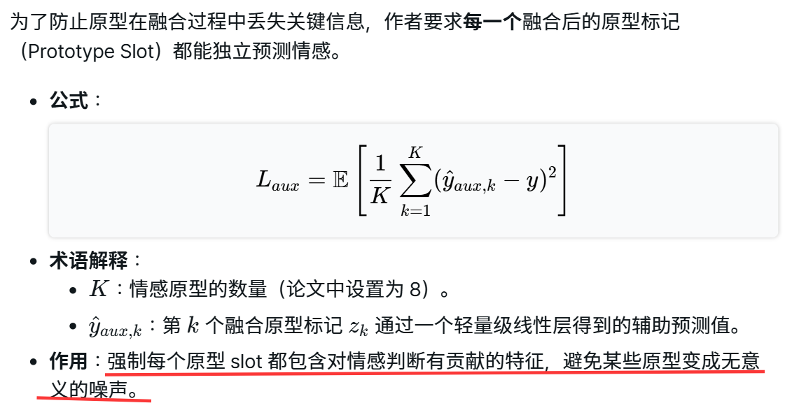
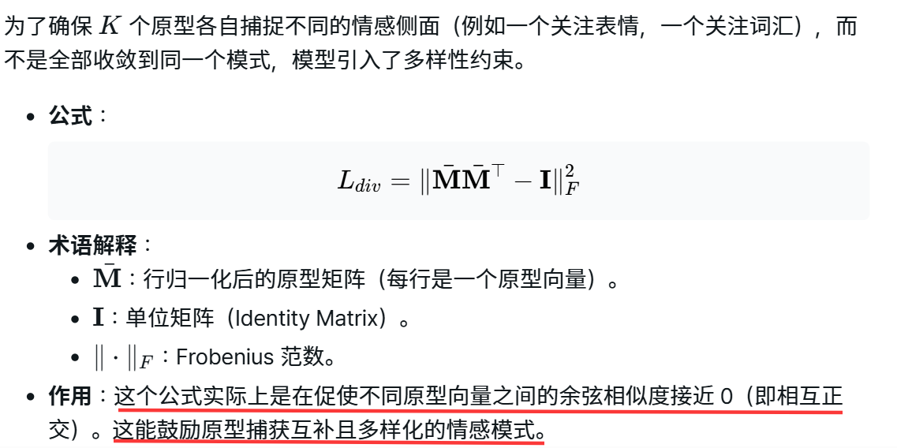

# 0.数据集

1. **CMU-MOSI (Multimodal Opinion Sentiment Intensity)**
这是该领域最经典的早期数据集，主要特点是小而精。

来源：来自 YouTube 的 89 个演讲视频（Movie Reviews）。
语言：英语。
规模：包含 2,199 个视频片段（Segment）。
标注：情感强度评分范围为 [-3, +3][−3,+3][-3, +3][−3,+3]（从极度负面到极度正面）。
价值：虽然数据量较小，但由于其标注质量高，被广泛用于验证模型处理情感细微差别的能力。

2. **CMU-MOSEI (Multimodal Opinion Sentiment and Emotion Intensity)**
它是 MOSI 的升级版，是目前规模最大、最复杂的英语多模态情感数据集。

来源：来自 YouTube 的 1,000 多位不同演讲者的视频，涵盖 250 个不同的主题。
语言：英语。
规模：包含 22,856 个视频片段，规模约为 MOSI 的 10 倍。
标注：除了 [-3, +3][−3,+3][-3, +3][−3,+3] 的情感强度外，还包含 6 种情感类别（快乐、悲伤、愤怒、恐惧、厌恶、惊讶）的标注。
价值：由于涉及的主题和演讲者极广，它极具挑战性，能有效测试模型的泛化能力和鲁棒性。

3. **CH-SIMS (Chinese Multimodal Sentiment Analysis)**
这是一个专门针对中文环境设计的先进数据集，由清华大学发布。

来源：来自中国电影、电视剧和综艺节目的剪辑。
语言：中文。
规模：包含 2,281 个视频片段。
标注：评分范围为 [-1, +1][−1,+1][-1, +1][−1,+1]。其核心特色在于提供了**“独立模态标注”（不仅有整体的多模态评分，还有单独看文本、单独听声音、单独看画面的情感评分）。
价值：它揭示了不同文化背景下情感表达的差异（如中文表达通常更内敛），且细粒度的模态标注非常适合研究 PRISM 这种强调模态重要性选择的模型。
# 1.motivation

1. 每种模态内部的情感证据并非单一的，而是由多种复杂的成分组成（且每种情感的共享不是均等的），当前大多数现有方法在进行情感推理之前，**习惯于将每个模态或融合后的特征压缩成一个单一的、紧凑的向量**，导致不同证据之间是互补、冲突还是可靠性差异的**细微结构被抹杀**了，模型难以在后续推理中恢复这些被坍塌的细节
2. 现有方法对模态可靠性的评估通常是一个静态或准静态的过程，即使是支持自适应加权的模型，通常也只在融合阶段计算一次权重，一旦融合完成，权重就被固定了，事实上，某个模态是否可靠，往往需要随着推理的深入、高层语义交互的形成才会变得更加清晰，**保证在推理过程中模态级别的可控制性。**
3. 现有的**原型学习（Prototype Learning）或瓶颈设计**多用于通用压缩，并没有强制要求模态之间共享相同的底层逻辑，且当前方法未考虑模态在空间上语义上对齐的问题。

> 总结研究动机的逻辑链：
- 特征层面： 不要直接压缩，要先分解（Decompose）成有结构的情感原型。
- 评估层面： 不要只评一次，要随着推理深度动态重绘（Reweight）。
- 对齐层面： 不要各说各话，要在共享槽位（Shared Slots）里进行跨模态博弈。

# 2.method

## 0.步骤

1. 模态编码
2. 基于情感原型库的原型驱动提取
3. 原型条件选择
4. 动态模态重加权推理
5. 生成情感强度预测
## 1.Modality Encoding
## 2.Sentiment Prototype Bank情感原型库

引入一个可学习的原型矩阵M ，维度为K\*d，其中包含K个原型向量{m1,m2,...},把这些原型想象成一组“标准感官查询器”。每个原型在训练过程中会逐渐专注于捕获某种特定的情感特征

所有三种模态共享相同的原型矩阵 M，但使用独立的交叉注意力参数

**keep slot semantics consistent across modalities 保持跨模态的槽位语义一致 slot如何理解?**
在数学表达中，槽位对应于矩阵Zm的每一行。如果你设置了K个 Sentiment Prototype，也就是原型向量，那么每个模态（文本、语音、视觉）都会被分解成**K行特征**，每一行就是一个“槽位”

功能定义：每个槽位就像是一个特定的过滤器或查询器。例如，假设第 1 个槽位专门负责寻找“积极的词汇”，第 2 个槽位负责寻找“激昂的语气”，第 3 个槽位负责寻找“紧张的面部表情”

**如何理解跨模态语义的一致性？**
在传统的 Multimodal Sentiment Analysis 方法中，不同模态的信息往往是杂乱无章地聚合在一起的，PRISM 通过共享同一个 Sentiment Prototype Bank (SPB) 实现了槽位的对齐：
- 共享基准：所有的模态（文本 、语音 、视觉 ）都使用同一个原型矩阵M作为输入。
- 语义对齐：这意味着对于任何一个样本，文本的第k行、语音的第k行和视觉的第k行，都在响应同一个情感原型（Sentiment Prototype）。

**“槽位” 就是由 Sentiment Prototype 在每个模态中提取出的结构化特征位置。所谓“语义一致性”，就是确保不同模态在同一个位置上处理的是同一种类型的情感逻辑，为后续的精确融合（Adaptive Fusion）打下基础**
## 3.基于原型的模态选择

**并非采用以文本为主导**
 
 - 结构化评估：与以往将整个模态压缩成一个向量的方法不同，PRISM 通过这个公式在K个不同的情感原型上分别评估模态。这意味着，一个模态可能在“视觉表情”原型上得分很高，但在“语音语调”原型上得分较低。
 - 共享基准：通过在评分时引入共享原型mk，模型可以确保对不同模态的评价是在同一个“情感坐标系”下进行的，使得跨模态的比较具有物理意义。

## 4.动态模态重加权

1. 输入序列构成：为了在推理过程中既能利用融合后的信息，又能保留对原始模态的直接访问，作者将输入序列设计为五个部分的拼接
 
2. 动态模态重加权 (DMR) 的计算
 
 3. 模态证据的缩放更新
动态过滤或增强尚未融合的原始模态线索
 

## 5.学习目标

1. 情感预测损失 最小化均方误差

2. 原型信息量辅助损失
 
 3. 原型多样性正则化
 
 4. 总体优化目标

# 3.创新点分析
 