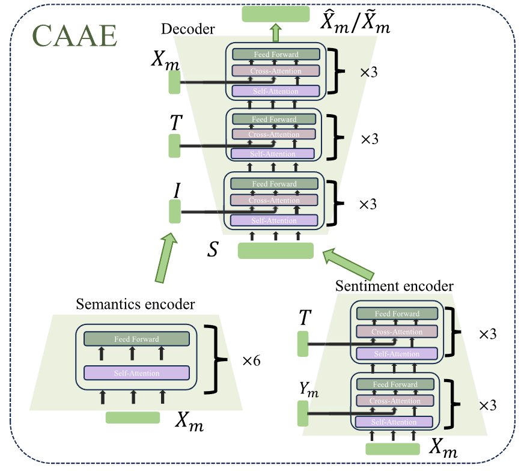

# Sentiment-Aware Disentangled Representation Shifting for Multimodal Sentiment Analysis
# 0.前备知识

- **Query（Q，查询）**：代表 “我要什么信息”，用来发起匹配。
- **Key（K，键）**：代表 “我有什么信息”，用来被 Q 匹配。
- **Value（V，值）**：代表 “我实际能给出的信息”，是最终被加权输出的内容。
三者都是输入 × 可学习矩阵

1. 自注意力（Self-Attention，如 Transformer 编码器）
- **Q = K = V = 同一输入 X**
- 原因：序列内部元素互相 **“查自己、查别人”**，比如句子中每个词都要和所有词做关联。
- 直观：“我问我自己和其他词，再从大家身上拿信息”。
2. 交叉注意力（Cross-Attention，如 Transformer 解码器）
- Q 来自解码器当前状态（目标端）
- K/V 来自编码器输出（源端）
- 例子：翻译时，生成英文词（Q）去查中文句子（K/V）。
- **Q 是当前要生成的，K/V 是已有的上下文**

# 1.面向的背景（痛点）

1. 现有方法中的特征提取与特征解耦都是独立进行的，忽略了多模态交互信息对其造成的影响
2. 现有的方法通常设计采用精巧的融合模块，忽略模态噪声信息对结果产生的干扰
3. 不够恰当的融合方式导致原始文本空间的破坏（因为都是以文本为中心）
# 2.相关工作

## MSA

1. 这些方法缺乏对非语言模态的信息过滤，导致大量冗余和不相关的信息被转移到文本模态中 此外，转移会**导致原始文本特征空间的破坏**，增加了微调下游预训练语言模型的难度
   
    - TFN 
    - MFN
    - 低秩多模态融合方法
    - 级别多模态特征融合，这需要使用强制对齐在语音和音频之间进行词对齐，以获得词级别特征 
2. 相比之下，仅提取**情感特定的特征**，通过对比学习进行跨模态表示转移，并通过跨模态投影模块减轻文本表示空间的变化
    - transformer的发展
3. 以文本为中心的融合方法
## 解耦学习

SDRS 框架在两个方面与这些方法显著不同：情感特定表示被显式解耦，并且在解耦过程中考虑了多模态交互。

# 3.Method
## 1.overview
## 2.CAEE

1. 两个粗粒度编码器 语义编码器与情感编码器Semantics encoder与Sentiment encoder
2. Semantics encoder输入为原始非语言特征Xm，抽取与情感无关或极为通用的