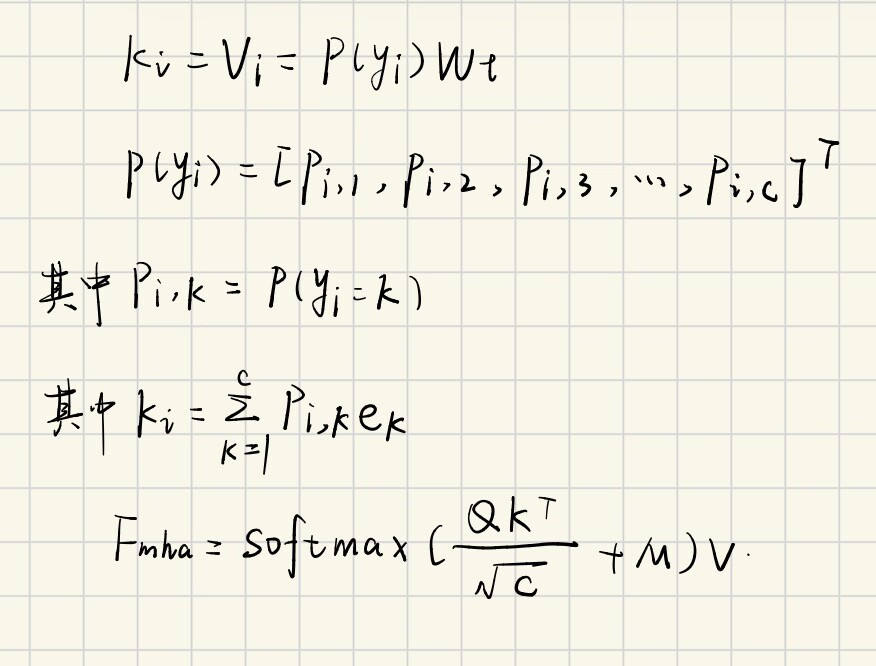

## 背景

*RNN & transformer where the linguistic rules are learned implicitly within a coupled mode*

所谓“隐式学习”（implicit learning）就是把 vision model (VM) 和 language model (LM) 放在同一个端到端网络里，语言知识不是单独建模成一个独立的语言模块，而是通过联合训练让解码器（通常是 RNN 或 Transformer decoder）在映射视觉特征到字符序列的过程中“顺带学会”语言统计和约束。可见[[零星#2.**什么时候用「编码器-解码器」（Encoder–Decoder）**]]

*论文指出这一类方法把语言规律藏在耦合的模型内部，具体学到了什么、好坏如何无法直接观测或控制*
- 可解释性差：无法单独评估或理解 LM 学到了哪些语言先验，难以诊断错误来源（是视觉弱还是语言弱）。
- 难以用大规模文本预训练：耦合模型难以直接借用 NLP 社区的海量文本资源对**语言能力进行独立预训练**。
- 容易发生“视觉帮忙作弊”与过拟合：联合训练时 VM 可能学出与 LM 联动的捷径，使得**训练损失低但泛化差**；***论文实验证明允许梯度流（AGF）会使 LM 过拟合并降低测试表现***

## 论文点

1. **将 LM 设计为自治模块（autonomous），通过阻断梯度流（BGF）使 LM 接受 VM 输出的概率向量为输入但不被视觉梯度影响，LM 被迫独立学习语言规律,从而实现显式语言建模、可单独预训练与迭代纠错等优点。**
2. **提出Bidirectional Cloze Network（BCN）——一种基于注意力掩码的双向 cloze 风格语言模型，能在并行计算下直接获得字符级的双向上下文表示并避免信息泄露，从而比两个单向模型的 ensemble 更高效且更强**
3. **提出基于迭代预测的 Ensemble Self-training 半监督方法：把多次迭代的预测视为一个 ensemble，用最小字符置信度与平滑策略过滤伪标签，从未标注图像中学习以提升性能** (?)

## 图解析

### 1.

a. 传统耦合模型：视觉与语言在训练/推理中紧耦合，梯度可往回流，语言知识是“隐式”在整体模型中学习的。无法单独评估/预训练语言模块；语言能力可能依赖视觉模块“作弊”而非独立学到语言规律。
b.视觉（Vision）与语言（Language）作为独立单元，中间有 Fusion（融合）；图中虚线箭头表示迭代/自回馈的预测流程。
- 自主（Autonomous）：训练时在视觉与语言之间阻断梯度流（Blocking Gradient Flow，BGF），迫使语言模块独立学习语言规则，**且语言模块可以用大量无标签文本预训练。**
- 迭代（Iterative）：**语言模块可以把其输出再反馈作为下一次输入（虚线回路），逐步修正视觉预测中的噪声。**
- 融合（Fusion）：视觉与语言的概率/特征在每次迭代通过门控机制融合，得到更稳健的最终预测。
c.  每个位置的预测同时被左右两侧上下文条件化（即真正的双向表示），注意力连接被掩码设计为“可以看左、可以看右，但不能看到自身（prevent seeing itself）”——实现 cloze（完形填空）式的预测,*与把两个单向模型（左→右 + 右→左）拼接不同，BCN 在单一模型里学到真正的双向上下文表示，计算与参数更高效。*

### 2.

#### Vision Model（上半部分）

Backbone：通常为 ResNet 等 CNN，**用于提取图像低/中级特征**
Position Attention：把空间特征映射到字符序列位置的查询上，产生按字符位置的视觉特征序列
Linear & Softmax：把每个位置的特征映射到字符类别概率
输出：
Vision Prediction（示例输出：“S H D V I N G”），其中部分字符可能被视觉误识（图中红色 V 表示错误）。
同时输出字符级的**概率向量（作为 LM 的输入）**。
#### Language Model（下半部分，BCN）

多层（Nx）Transformer-like 层，但设计为“cloze”式的 b**idirectional cloze network（BCN）**。
每层包含 Multi-Head Attention（使用特殊的 attention mask，避免“看到自己”）和 Feed Forward[[零星#3.Feed Forword]]。

输入与输出：
输入是来自**视觉模型的字符概率分布（或上一次融合后的概率）**，而非原始图像特征。
输出是语言修正后的字符概率（Language prediction），用于**与视觉概率融合或作为下一轮迭代的输入**。

1. 双向性（Bidirectional）：
通过注意力屏蔽策略，BCN 在预测某一位置时同时利用左右两侧的上下文（不像普通单向自回归只用左侧或右侧信息）。
这使得 LM 能像完形填空（cloze）任务那样用双侧信息恢复不清晰字符。
2. 自主性 梯度隔断
图中左侧标注 Autonomous，并用闪电符号或虚线表示“阻断梯度流”：
在训练时，从视觉模型到语言模型的输入处阻断梯度（BGF），即语言模型不会把训练得到的梯度回传去“教”视觉模型。
强制 LM 独立学习语言规则（显式建模），避免在训练时被 VM “作弊”式地辅助，从而更可迁移、可预训练（可用大规模无标签文本预训练 LM）。
3. 迭代执行（Iterative）
流程示意：
要有个前提的吧 就是VM把字符概率分布传给LM，进行首次fusion

第一次迭代（Iteration @1）：VM 产生视觉概率 -> LM 修正 -> 与视觉融合（Fusion）得到 Fusion Prediction@1。
随后迭代：将上一次融合的概率再送入 LM（而非再次回到原始视觉输出），LM 再次校正，得到更好的 Fusion Prediction@2、@3……

通过多次迭代，LM 能逐步纠正视觉误识（例如把“SHDVING”逐步修正回“SHOWING”）。
迭代还能缓解“长度不对齐”问题（unaligned-length）：逐步融合有助于调整预测长度与内容。

**总结：
- LM作为独立的模型修正字符错误
- 练梯度的流动在输入向量处被阻塞 
- LM 可单独从无标签文本数据中训练

## Methods

1. LM 把概率向量视为特征向量并进行线性映射与注意力运算。论文明确写出映射关系：$K_i=V_i=P(y_i)W_l$  先把每个位置的C维字符概率向量$P(y_i)$映射到C‘维，再参与muti-head attention的上下文聚合
2. 一个位置上的 softmax 概率不仅表明最可能的字符，也隐含了模型对多个候选字符的相对信心与不确定性。LM 能基于这种“分布模式”结合左右位置的分布模式判断语义一致性并重新分配概率质量。  **LM 学的不是“概率的值要完全记住”，而是“如何基于邻位概率格局与语言先验，把输入分布变成更合理的输出分布”**

**双向性：**

- Q是位置编码，论文把Q作为注意力查询，在第 1 层Q被设为表示字符顺序的位置编码；在后续层Q则用上一层的输出作为 query（即逐层更新的 query），**直观上，Q告诉模型“要预测序列中第 t 个位置”并携带位置信息，配合 K/V 做上下文聚合**
- $K_i$和$V_i$是按概率对每个字符 embedding 的加权平均（期望)
    - 捕捉不确定性：如果 VM 在某位置不确定（概率分布平坦），$K_i$就是多类 embedding 的混合，保留了候选集合与相对置信信息；若很确定（某一类概率接近 1），$K_i$接近该类对应的 embedding。  
    
    - 允许注意力用“分布特征”做交互：attention用$QK^T$计算相似性时，实际上是在比较query与概率加权的类emdedding之间的相容性，从而基于邻位的分布模式调整本位预测
    
    - 对“soft decisions”友好：相比把概率 argmax 成离散 token（丢失不确定性），用概率的期望 embedding **保留了全部候选信息**，LM 可据此做更细粒度的纠错与重分配。
### 为什么论文中设定K=V?

在标准 attention 里 *K 提供匹配键，V 提供被聚合的内容*。把 K 和 V 都设为相同的概率投影意味着 attention 的**加权聚合输出也是基于同样的概率加权类 embedding —— 聚合后得到的表示既体现了哪些邻位被“关注”，也同时把这些邻位的分布信息带入到输出表示中，便于后续层进一步处理。**

# 答疑

## 1.论文中提到的BCN与BERT的区别

1. BERT 的建模方式与代价BERT 是基于 Transformer 的 encoder，采用 Masked Language Model (MLM) 训练，通过遮掩（mask）部分 token 并预测其真实 token 来学到深度双向表示；  要在推理时做“逐位置完形填空”式的预测（把每个字符当作被 mask 的目标）的话，需要对同一序列分别多次遮掩并**多次前向计算**，这在 STR 中会产生极高的计算开销。

2. BCN 的设计目标与实现差异（为 STR 定制）BCN 是一个变体（variant）的 Transformer decoder，并不是直接使用 BERT 的 encoder 及其 MLM 策略,**论文通过设计特定的 attention masks 来实现 cloze（完形填空）式的双向上下文建模，从而在一次并行前向中得到双向表示，而无需对每个位置重复调用模型**。 

3. BCN 禁用了常规的自注意力以“避免跨步泄露信息”，并把输入设为来自视觉模型的字符概率向量（soft probabilities），而非离散 token id

4. 同时在 multi-head attention 中把 K、V 由概率映射得到并用掩码阻止“看到自己”。这些实现细节和输入/输出接口显著不同于 BERT。 

 **结论：BCN 的概念受 BERT（MLM）启发——都试图用双向上下文做“填空”式建模——但在输入形式（概率向量 vs. token ids）、网络结构（decoder-variant，禁用自注意力并使用特定 attention masks）、执行方式（并行一次性得到双向上下文而非对每位置反复调用 MLM）和效率权衡上都有显著差别**