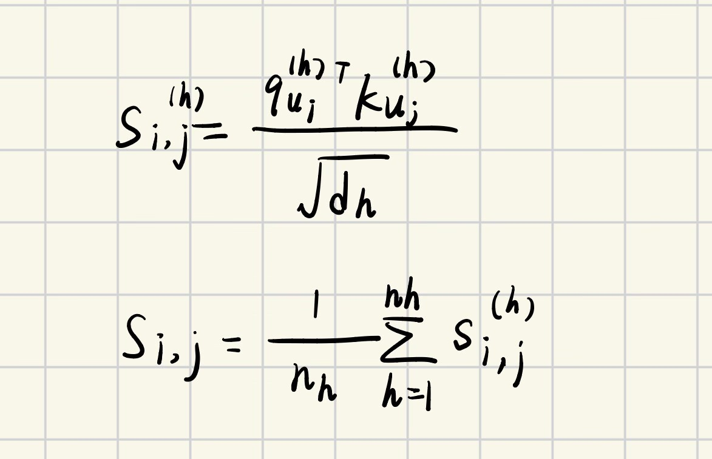
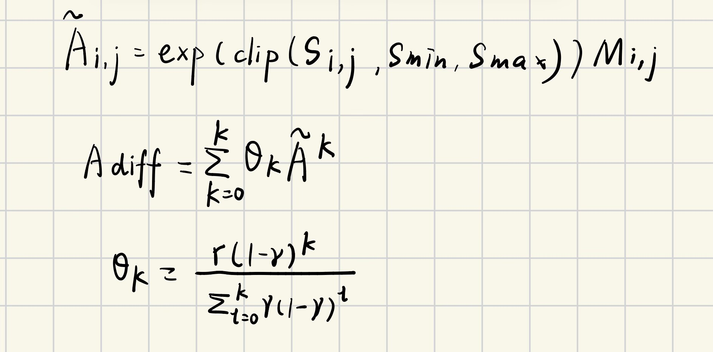

# 0.一些名词解释

Multimodal Sentiment Analysis（多模态情感分析，简称 MSA）旨在同时利用文本、音频和视觉信号来推断人的情感强度与极性
## flattened cue collapse

原本有结构、互相作用的细粒度非言语线索（如若干面部动作单元的组合、或某种微妙的声学颤动与节律）被简化为无结构的、平等对待的特征集合，导致有意义的交互模式消失或被稀释。

细粒度MSA方法在处理面部和声学线索时，常把这些信号“扁平化”处理——即把大量细小、结构化的非语言线索丢进一个平铺的描述或向量中，没保留它们之间的结构性关系，这种做法会导致“subtle affective evidence”（微妙的情感证据）被更显眼但不一定相关的特征覆盖/淹没，从而降低对细微情感变化的辨别能力。
## 细粒度

关注情感信号中那些时空上更细微、信息更稀疏但对判断情感强度／微小变化很重要的非语言线索，而不是只看整体句子级或视频级的粗分类。换言之，目标是分辨相邻片段间的微小情感差别与强度变化，而不是仅做正/负极性的大类判别。
### 粗粒度与扁平化

- 粗粒度：例如仅基于整句文本或整段音视频做情感回归/二分类，或把所有非语言特征拼成一个向量直接与文本拼接，侧重显著、宏观信号。  
- 扁平化（flattened）：把面部和声学的多维、结构化信息转换成单一描述（如文本化的情绪描述）或单向量，使得原有的组合、依赖关系（哪个 AU 常与哪种 prosody 共同出现）丢失，从而弱化微小但有判别力的信号。  
**细粒度方法则试图保留这些结构与组合（用图建模 AUs 与 prosody 节点、用心理学先验强化典型共现），因此更能区分相邻片段中微弱但语义重要的变化（例如论文在 Acc‑5/Acc‑7 上的改进）。**
## 强化共现模式与特定视图解耦
### 强化共现模式
指的是基于心理学/情感研究事先知道的那些面部动作单元（AUs）与声学韵律特征（如 pitch、loudness、jitter、shimmer 等）在情感表达中常同时出现的组合关系。论文把这些“典型同时出现的组合”作为结构性先验来增强模型对这些组合的关注。

**让模型在传播信息时优先放大这些被心理学支持的通路，而不是把所有可能的节点间互动都同等看待，进而抑制偶发的、个体习惯性的噪声信号（即缓解 flattened cue collapse）**

### 特定视图解耦

“视图（view）”指论文中的三类子图读出：全视图（full-view，z）、音频中心视图（audio-centered，z_a）、视觉中心视图（visual-centered，z_v）。每个视图强调的是不同的上下文与中心模态信息

“解耦（disentanglement）”是把传播后得来的子图表示分解成若干语义因子（semantic factors），论文采用四类因子：acoustic-unique（Uni-A），visual-unique（Uni-V），redundant（Red），synergistic（Syn）

“特定视图”解耦即在不同视图上分别做解耦，使得同一类因子在不同视图下可以体现出不同的语义侧重（例如 audio-view 下的 Uni-A 更侧重音频中心的独有信息，full-view 下的 Uni-A 可能偏向全局支持的音频特征）。

## typical co‑occurrence patterns 典型共现特征

某些面部动作单元（AUs）和声学/韵律特征（如 pitch、loudness、jitter、shimmer）在表达情绪时会**以相似的组合反复出现**——而且这些组合并不是只对应一种情绪，而是跨多个情绪类别共享的“**典型共现模式**”

如果 AU 与声学特征的共现是稳定且经常出现的，那么可以把这些共现关系作为先验知识（psychology‑guided prior）来约束图模型的连边，从而把传播集中在“心理学支持”的通道上，**抑制偶发、个体习惯导致的噪声**

## 采用多跳传播和PPR指数衰减强化共现特征

多跳传播（multi-hop propagation）通过在心理先验掩码限定的拓扑上沿多跳路径累积信号，从而把在**多个路径/邻域中反复出现的共现组合放大，而把仅在孤立位置出现的偶发特征抑制**；
PPR 风格的指数衰减与残差连接一起保证既能获得远端支持又不丢失节点自身信息，从而“强化典型共现特征”

传播只在“心理学支持”的边上发生：作者用从心理学文献构建的二值先验邻接掩码 $P_{sub}$​，并把它作为注意力掩码M，因此**传播仅沿这些被支持的通道展开，而不会在任意两节点间平均扩散**

多跳累积使“重复出现的共现”被放大：单跳注意力只看邻居；多跳传播通过矩阵幂把长度为K的路径上的信息汇聚回来，所以如果**某一组 cue 在图中通过多条路径或在多个跳数上相互连通（即典型共现在局部结构中多次被支持）**，**它们的相互影响会在不同K项上被多次累加，从而放大该组合的总贡献**

指数衰减（PPR）避免噪声随距离无节制放大，因为远跳的权重按照$(1-y)^k$衰减，**只有那些在较近跳数也被支持或在多条短路径上反复出现的组合才会获得显著累积权重**；**孤立、偶发或仅通过很长稀疏路径连接的 cue 因权重衰减而难以被放大**

残差连接保留节点自身信息，避免过平滑：最终更新$H^+=H+A_{diff}H$把原始自身表征保留为主干，传播只是“增强”而非替换，从而防止细微但重要的节点特征被全局平均掉

# 1.Methodology

## 输入处理

作者采用“**两阶段 unimodal 编码**”来得到每个模态的统一表示（文本/音频/视觉）
先用已有工具把原始信号编码为 $I_m$（**文本用 BERT，音频用 Librosa，视觉用 OpenFace**），再做线性投影和 Transformer 编码，得到$$X_m=Transformer(Linear_m(I_m))$$基于观察(transformer前几个token含有最多信息)，只保留前T=8个 token 作为该模态的特征

## Psychology-Guided GNN Construction 

1. 面部动作编码系统（FACS）和情感声学研究。这些心理学文献总结了人类在表达特定情感时，面部动作和声音特征是如何成对出现的。
2. **跨情绪重叠、提取通用模式**：如果某两个特征（比如 AU06 和 AU12）在“快乐”中同时出现，在“惊喜”中也同时出现，那么这两个特征之间就存在一种结构化的强耦合关系。**只有那些在多种情绪类别中重复出现的共现模式，才会被保留下来。**
3. 作者将这些关系填入一个 28×28 的表格（矩阵）中：规则：如果节点 i（比如 AU01）和节点 j（比如 Pitch Low）在心理学上被证明是典型共现的，就填入 1。如果不相关，就填入 0
### 子图诱导
对于每一个输入的短视频样本（Segment），模型首先统计哪些特征被激活了：
- 视觉：OpenFace 检测当前的 16 个 AU 强度，只保留那些确实发生了的 AU（通常是取强度最高的前 8 个，或者超过设定阈值的）。
- 听觉：openSMILE 提取当前的音高、响度等，并根据分箱规则判定它们属于哪个状态（例如，判定当前响度属于 Loudness High）。
- 得到一个当前活跃节点的集点Upresent​
- 模型去翻那张全局的  28×28 心理学先验矩阵P，只保留 Upresent 涉及到的行和列，删掉没出现的节点 $P_{sub}$
- **特征映射**
    - 模型从预先用 BERT 编码好的 28 个语义向量里，按编号取出对应的N个向量
    - **形成初始特征矩阵H，维度为N\*d,d指的是每个特征的向量长度**
H与$P_{sub}$一同进入下一模块

## Masked Hop-Diffused Attention Propagation

### 1.多头自注意力相似度计算

S表示在第h个注意力头中，节点ui对节点uj的原始注意力得分
q表示节点ui的查询向量，它是通过将节点的 BERT 嵌入向量与可学习权重矩阵Wq​相乘得到
K表示节点uj的键向量
nh注意力头的总数
Si,j最终聚合后的相似度矩阵元素
通过对多个头的得分取平均，模型可以同时捕捉节点之间不同维度的语义关系
### 2.掩码传播矩阵计算

- 解决“扁平线索崩溃” (Flattened Cue Collapse): 传统的模型通常不考虑非语言线索间的结构关系。**该公式通过Mi,j强制让信息只在符合心理学逻辑的路径上流动**。
- 抑制噪声干扰: 与普通的 Graph Attention Network (GAT) 不同，这里不进行行归一化。这种设计使得获得多个典型共现模式支持的线索**能够保留更大的权重**，而孤立或不符合心理学先验的随机干扰（噪声）会被结构性地削弱。
- 结合数据与先验: 它将样本特有的动态注意力 Si,j 与**通用的心理学知识 Mi,j 结合**，实现了情感特征的精细化增强
## 3.基于PPR的扩散矩阵

Adiff最终用于更新节点特征的传播矩阵

- Adiff：这是最终用于**更新节点特征的传播矩阵**。它综合了从当前节点（0跳）到远端节点（K跳）的所有结构信息
- A:代表一步邻接矩阵，特别之处在于它经过了心理学先验知识的遮罩处理，只有符合心理学共现规律（如特定的面部动作单元 AU 与声音特征的组合）的边才会被保留和强化
- y:指数衰减因子，y越大，权重越集中在本地邻居（近距离线索）；y越小，模型越关注全局上下文。**论文实验发现 y=0.6 时效果最佳，能在保留局部细节和获取全局背景之间达到平衡**

## 4.Multi-View Subgraph Readout

### 1.
- h'：表示经过“心理学引导的模式增强扩散”模块处理后的第 i个节点的特征向量
- Wh和w：是模型待学习的权重矩阵和向量，用于评估该节点在当前情感上下文中有多重要
**计算每个节点（如某个面部动作单元 AU 或某个声学特征）对于最终情感预测的“贡献度”初步评分。**

$$a_i = \mathbf{w}^\top \tanh(\mathbf{W}_h \mathbf{h}'_{u_i})$$
### 2.
- softmax函数
- $m_j$:是一个二值掩码（Mask）。如果节点 j属于当前选定的子图集合(例如仅包含视觉相关的AU节点）,则mj=1，否则为0
**它确保了所有被选中节点的权重之和为1，从而能够公平地在特定子图视图内分配注意力。**
$$\quad \alpha_i = \frac{\exp(a_i)}{\sum_{j: m_j=1} \exp(a_j)}$$

### 3.加权聚合

- 节点特征与其注意力权重相乘并求和，最终得到的该视图的浓缩表示

$$\quad \mathbf{z}_{\text{agg}} = \sum_{i: m_i=1} \alpha_i \mathbf{h}'_{u_i}. $$
- 通过变换不同的掩码m，模型可以分别生成“全视图”、“视觉中心视图”和“音频中心视图”的特征。这为后续的“交互感知语义解耦”提供了基础
- 注意力机制允许模型自动忽略那些在特定情境下不相关的噪声节点，而专注于那些符合心理学共现模式的核心特征
- 与简单的平均池化不同，这种方法保留了图传播后蕴含的细粒度结构化信息，有效缓解了作者提到的“扁平化线索坍塌”问题。
