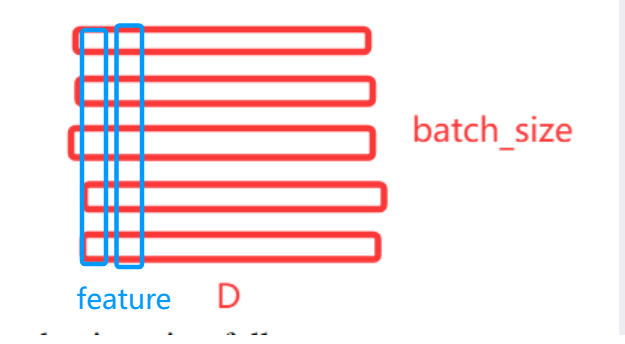
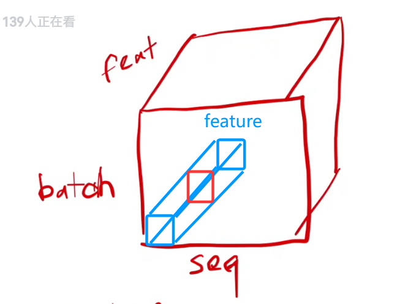
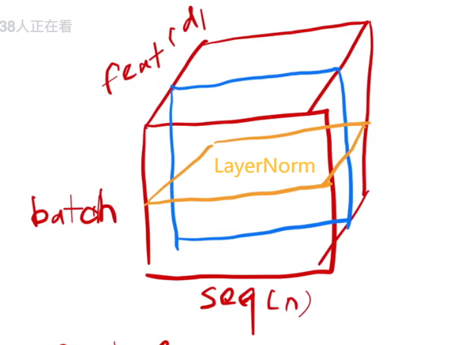

<br>
D是mini_batch?
BatchNorm是对每个feature做均值

对于三维的话，每个sequence有n个特征
对每个sequence的同一特征做均值

## LayerNorm
 另一种广泛应用于深度学习的归一化技术。与 Batch Normalization（BN）不同，LayerNorm 不依赖于 mini-batch 的统计信息，而是对==单个样本在所有特征维度上进行归一化==。它的归一化对象是一个样本内部的所有特征，**而不是一个批次（batch）中所有样本的同一个特征**
 - 独立于批次大小
 - 适用于序列模型
 - 加速训练和稳定梯度
 - 无需维护全局统计量

## 注意力机制

### 初步理解

Q 的值 $$[1.0, 0.0, 2.0] $$是“it”这个词在当前3维特征空间中的一个特定表示。
K 的每一行 $$[1.0, 1.0, 0.0], [0.0, 1.0, 1.0], [2.0, 0.0, 1.0]$$ 是**其他3个词**在同一个3维特征空间中的“标识”表示。V 的每一行$$ [0.5, 1.5], [1.0, 0.5], [0.0, 2.0] $$是其他3个词所携带的==“信息内容”==.
通过==计算 Q 与 K 的相似度==，得到权重，再用权重(softmax计算概率)去加权求和 V（V中携带的是真实信息），模型就能根据“it”这个词的查询，动态地从其他词的信息内容中提取出最相关的部分

### 公式

$$
\text{Attention}(Q, K, V) = \operatorname{softmax}\left(\frac{QK^T}{\sqrt{d_k}}\right)V
$$
![[16.png|150]]

计算流程 (Calculation Flow):
**MatMul (Q, K)**: 首先，Queries (Q) 和 Keys (K) 矩阵进行==矩阵乘法==。这个操作计算了每个 Query 与所有 Key 之间的点积相似度得分。得分越高，表示 Query 和对应的 Key 越匹配。
数学表示为：$$Q K^T$$
**Scale (缩放)**: 接着，上一步得到的相似度得分矩阵被除以 √dk，其中 dk 是 Keys (K) 向量的维度。这个缩放操作是为了==防止在 dk 较大时，点积的数值过大==，==导致 Softmax 函数的梯度变得非常小，从而阻碍模型的训练。==
数学表示为：$$\frac{Q K^T}{\sqrt{d_k}}$$
**Mask (opt.)**:  这个掩码会“屏蔽”掉一些不应该被注意到的位置（例如，在预测当前词时，不应该看到未来的词）。被掩码的位置通常会被设置为==一个非常小的负数==（如 -∞），以确保在==Softmax==后它们的权重接近于零。
SoftMax: 经过缩放和可选的掩码后的得分被输入到 Softmax 函数中。Softmax 将这些得分转换成一组概率分布，==表示每个 Value 应该被赋予多少权重==。所有 Value 的权重加起来等于 1。
数学表示为：$$\text{softmax}(\frac{Q K^T}{\sqrt{d_k}})$$
**MatMul (result, V)**: 最后，Softmax 输出的权重矩阵与 Values (V) 矩阵进行矩阵乘法。这将根据注意力权重对 Values 进行加权求和，生成最终的输出。权重高的 Value 会对最终结果贡献更多。
**最终输出是一个根据 Q 和 K 的匹配程度，加权了 V 的结果。它捕获了输入序列中与当前 Query 最相关的信息。**
### 多头注意力机制

![[mutihead-attention.png|250]]
**线性投影 (Linear)**:
在将Q、K、V输入到注意力计算之前，它们会分别通过==不同的、可学习的线性变换（即一个权重矩阵乘以输入向量）==
图中的三个“Linear”层分别对应于将原始的Q、K、V投影到h个不同的低维子空间中。这意味着，对于每一个“头”（head），模型都会有独立的线性投影矩阵（$W^Q_i, W^K_i, W^V_i$）。
这样做是为了**让模型能够关注到不同的表示子空间**。例如，一个头可能关注词语的语法关系，另一个头可能关注语义关系。

**并行注意力计算 (Scaled Dot-Product Attention, h times):**
经过线性投影后，Q、K、V被分割（或看作是h组独立的投影向量）。
图中的h表示存在h个并行的“Scaled Dot-Product Attention”模块。每个模块接收一组投影后的Q、K、V。
每个==“头”都独立地执行“Scaled Dot-Product Attention”==计算。其公式为：
$$Attention(Q, K, V) = \text{softmax}(\frac{QK^T}{\sqrt{d_k}})V$$
其中，$d_k​$是键向量的维度。这个缩放因子$\sqrt{d_k}$是为了防止点积过大导致softmax函数梯度过小。

拼接 (Concat):
h个注意力“头”的输出（每个头输出一个d_v维度的向量）被拼接在一起，形成一个更宽的向量。如果每个头的输出维度是dv，那么拼接后的维度将是h * dv。

最终线性投影 (Linear):
拼接后的向量最后会通过另一个线性变换,将其映射回原始的d_model维度。
这个最终的线性层将所有头的注意力输出整合起来，形成多头注意力的最终输出。

### Applications of Attention in our Model
"the queries come from the previous decoder layer,
and the memory keys and values come from the output of the encoder."

#### encoder与decoder之间的mask-mutihead&decoder self
Query就是解码器下一个要生成的词语
Keys and Values是编码器的最终输出
在解码器生成每一个输出词的步骤中，它都可以自由地“查看”和“评估”整个输入序列（由编码器的 K 和 V 代表）的每一个部分。

#### self-Attention
Q、K、V 的来源统一: 在自注意力中，Query (Q)、Key (K) 和 Value (V) 都从同一来源产生，即编码器前一层的输出。这种机制使得编码器中的每一个位置（词或子词）都可以“关注”或“参与计算”输入序列中所有其他位置的信息

#### Embeddings and Softmax
使用学习到的嵌入层来将输入序列（例如，源语言的词语）和输出序列（例如，目标语言的词语）中的离散的 tokens（词或子词）转换为**连续的向量**。
在解码器（Decoder）的最后，模型会生成一个向量，这个向量代表了对下一个词的预测。转换过程: 为了得到每个可能词语的概率，需要经过一个学习到的线性变换（乘以一个权重矩阵）和一个Softmax 函数。
Transformer 模型在这里采用了**权重共享**的策略。它共享同一个权重矩阵，用于：输入嵌入层 (input embedding layer)输出嵌入层 (output embedding layer)预 Softmax 线性变换 (pre-softmax linear transformation)

## 代码讲解

```python
sentences = ['ich mochte ein bier P', 'S i want a beer', 'i want a beer E']
```
P 填充字符 因为一个batch中每个样本的长度会不同
### 维度解析
- `enc_outputs: [batch_size, src_len, 512]`
`batch_size`：一次同时送进模型的句子数量
`src_len`：每句话里源序列的token 个数
`512`：每个 token 对应的向量维度，也就是 `d_model`
也就是说一个词（一个token）在Transformer中通常会表示成一个1\*512的向量

如果输入是： `Q`: `[2, 5, 512]`
那么会这样变化：
1. 线性映射后：`[2, 5, 512]`
2. 分成 8 头：`[2, 8, 5, 64]`
3. 每头做注意力：`[2, 8, 5, 64]`
4. 拼接回来：`[2, 5, 512]`
5. 线性融合：`[2, 5, 512]`
6. 残差 + LayerNorm：`[2, 5, 512]`
### 类讲解

#### pad-mask
```python
def get_attn_pad_mask(seq_q, seq_k):
    batch_size, len_q = seq_q.size()
    batch_size, len_k = seq_k.size()
    # eq(zero) is PAD token
    pad_attn_mask = seq_k.data.eq(0).unsqueeze(1)  # batch_size x 1 x len_k, one is masking
    return pad_attn_mask.expand(batch_size, len_q, len_k)  # batch_size x len_q x len_k
```
由于一个batch中每个句子的长度不一，存在padding部分 这个类是为了找出padding部分
#### subseq-mask
```python
def get_attn_subsequent_mask(seq):

    attn_shape = [seq.size(0), seq.size(1), seq.size(1)]
    subsequence_mask = np.triu(np.ones(attn_shape), k=1)  # 生成一个上三角矩阵
    subsequence_mask = torch.from_numpy(subsequence_mask).byte()
    return subsequence_mask  # [batch_size, tgt_len, tgt_len]
```
取上三角矩阵，意思是：
- 第1个词不能看第2、3、4、5个词
- 第2个词不能看第3、4、5个词
- 第3个词不能看第4、5个词
- ...
### MultiHeadAttention

```python
        self.W_Q = nn.Linear(d_model, d_k * n_heads)
        self.W_K = nn.Linear(d_model, d_k * n_heads)
        self.W_V = nn.Linear(d_model, d_v * n_heads)
        self.linear = nn.Linear(n_heads * d_v, d_model)
        self.layer_norm = nn.LayerNorm(d_model)
```

- 三个线性层每个token为512 维向量，经过线性变换后，仍然是 512 维，但这 512 维会被拆成 8 个头，每头 64 维
- `self.linear = nn.Linear(n_heads * d_v, d_model)` 把多个头拼接后的结果重新映射回d_model维度
- `self.layer_norm = nn.LayerNorm(d_model)`对最后输出做层归一化

```python
        q_s = self.W_Q(Q).view(batch_size, -1, n_heads, d_k).transpose(1,2)  
        k_s = self.W_K(K).view(batch_size, -1, n_heads, d_k).transpose(1,2)  
        v_s = self.W_V(V).view(batch_size, -1, n_heads, d_v).transpose(1,2)
        attn_mask = attn_mask.unsqueeze(1).repeat(1, n_heads, 1, 1)
```
- `Q` 原来是 `[B, len_q, 512]`
- 经过 `W_Q` 还是 `[B, len_q, 512]`
- 然后 reshape 成 `[B, len_q, 8, 64]`
- 再 transpose 成 `[Batch, 8, len_q, 64]
==每个token不再是512维表示，而是被拆成8个头 64维==
k_s 与 v_s同理

`attn_mask = attn_mask.unsqueeze(1).repeat(...)`原始 `attn_mask` 只有`[B, len_q, len_k]`
但现在我们有 8 个头，每个头都要一份 mask，所以扩展成：==`[B, 8, len_q, len_k]`==

### 调试过程

`x=tensor([[[-1.1745,  0.0000,  0.1529,  ..., -1.1394,  0.2503,  1.8943],
        `` [ 2.7432,  1.0540,  0.9958,  ...,  1.8775, -0.3159,  3.2076],
        `` [ 0.0000,  0.9898,  0.1635,  ...,  0.0000,  1.1640,  0.0000],
         `[ 0.1030, -2.5314,  2.0274,  ..., -0.6437, -1.6509,  1.7428],
         `[ 0.8848,  0.0000, -0.0000,  ...,  1.1499,  0.0000,  1.5663]]]
         
传进去是同一个 `enc_inputs` 三次,Q，K，V都来自encoder的inputs
`x` 是一个三维张量，维度是：`(1, 5, 512)`
residual也等于原始的输入x

```
tensor([[[[-1.0089, -0.8424,  1.0237,  ..., -0.8892,  0.7838, -0.4685],
          [ 0.2608,  0.0635,  0.8081,  ..., -0.4133,  1.5589, -1.3648],
          [-1.3302, -0.3065, -0.2865,  ..., -0.2959,  2.0339, -0.9234],
          [-0.3500,  0.9859,  0.2491,  ..., -0.6202,  0.6691, -1.2088],
          [-0.3813,  0.3351,  0.1081,  ...,  0.0785,  1.0651, -0.6247]],

         [[-2.2919, -0.8238, -0.7693,  ...,  1.1155, -0.8877, -0.5558],
          [ 0.6494, -0.3231, -0.1623,  ...,  0.4172, -0.3036, -0.8541],
          [ 0.0768, -1.2208, -0.3514,  ..., -0.6463,  0.1818,  0.4275],
          [ 0.6057, -0.5846,  0.9139,  ...,  0.5983,  0.2363,  1.3510],
          [ 0.1699, -0.6154, -1.0699,  ..., -0.4063,  0.0757, -0.8984]],

         [[ 0.7249,  0.6217, -0.8688,  ...,  0.2451,  0.6098, -1.0368],
          [ 0.9018,  1.2214, -1.0007,  ...,  0.7989, -0.0493,  0.1586],
          [ 1.7692,  0.7776, -1.5978,  ..., -0.3724,  0.2934, -0.2470],
          [ 2.0300,  0.1950, -0.7354,  ...,  0.3133, -0.9066,  0.4135],
          [ 0.5448, -1.3930, -0.3746,  ...,  0.5662, -0.4243,  0.3816]],

         ...,

         [[-0.4666,  0.9110,  0.1570,  ...,  0.3043, -0.1206, -1.0785],
          [ 0.6100, -0.2637,  0.1249,  ...,  0.1632, -0.1085, -0.1174],
          [-0.1992, -0.1374,  0.0588,  ..., -0.6439,  0.5716, -1.6114],
          [ 0.6655, -0.2982, -0.0545,  ...,  0.7681,  0.8930, -0.8331],
          [-0.6525,  1.1815,  0.6659,  ...,  1.2855,  0.4697, -0.7950]],

         [[ 0.2807,  0.1910,  0.6623,  ...,  1.0668,  0.9363, -0.6144],
          [ 0.4067,  0.6280,  0.3681,  ..., -0.0913,  0.8250,  0.4136],
          [-0.1621,  0.2348,  1.0424,  ...,  0.2055,  1.0007,  0.1772],
          [ 0.2337,  1.5452,  1.3401,  ...,  0.7808,  0.5207,  0.9208],
          [-0.8776,  0.0407,  1.2582,  ...,  1.4225,  0.5364, -0.6753]],

         [[ 0.1689,  0.2527,  0.3113,  ..., -0.1687, -0.1925,  0.2711],
          [ 0.5742,  0.7648, -0.8837,  ..., -0.5222,  0.9491, -1.3238],
          [ 0.1575, -0.2360,  0.4431,  ..., -0.7316,  0.9125,  0.9692],
          [ 0.5894,  0.1059, -0.2554,  ..., -1.5580,  1.5765, -0.8131],
          [ 0.4999,  0.2583, -0.2470,  ...,  0.1692, -0.1313,  0.0974]]]],
       grad_fn=<TransposeBackward0>)
```
- `q_s`: `[batch_size, n_heads, len_q, d_k]`
- `k_s`: `[batch_size, n_heads, len_k, d_k]`
- `v_s`: `[batch_size, n_heads, len_k, d_v]`

**scores_before_mask**
```
tensor([[[[ 1.7093e-01,  1.6377e-01,  1.6443e-01, -9.1711e-01,  1.7746e-01],
          [ 4.2475e-01,  3.8445e-01,  9.9425e-01,  1.5591e-01,  2.3502e-01],
          [-3.1256e-01,  5.4095e-01,  6.9581e-01,  9.4031e-02, -4.6997e-02],
          [-7.5099e-01,  5.4800e-02,  7.4913e-02, -5.6967e-01,  3.6061e-01],
          [-5.6091e-01, -7.9312e-01,  7.6738e-01, -6.9362e-02, -6.3083e-03]],

         [[ 6.0094e-01,  4.1480e-01, -2.2250e-01, -5.0846e-02, -6.2413e-01],
          [ 6.3086e-01,  5.9135e-02, -3.1997e-01,  4.1385e-01, -5.2037e-01],
          [ 4.6007e-01,  9.8529e-01, -1.3922e+00, -3.5001e-01, -1.1676e+00],
          [ 4.9766e-01, -2.8665e-01, -6.5504e-01, -6.7920e-01,  2.2902e-01],
          [ 8.7398e-01,  1.6633e-01, -4.7427e-01, -3.3706e-01, -5.9552e-02]],

         [[-3.4287e-01,  3.2879e-01,  5.8368e-01, -8.4975e-02,  3.7691e-01],
          [-7.1248e-01,  3.1149e-01, -5.3354e-01, -4.5930e-01, -8.5828e-01],
          [-4.2535e-01,  2.6957e-02,  5.6418e-01,  2.6931e-01, -8.0030e-02],
          [-3.8966e-01,  5.5200e-02,  1.2441e-01, -2.0263e-01, -4.0495e-01],
          [-4.7801e-01, -4.3839e-05,  5.5747e-01, -6.1195e-01, -1.9237e-01]],

         [[ 9.6311e-01,  2.3183e-01, -3.3809e-01,  6.5435e-03, -6.9691e-02],
          [-6.3458e-01, -2.4416e-01, -4.8344e-01, -2.3647e-01, -1.7580e-03],
          [-2.6240e-01,  6.0129e-01, -1.4172e-01,  1.3070e-01, -5.6440e-01],
          [-2.8358e-01, -3.5719e-01, -3.8222e-01, -4.6316e-01, -3.8898e-01],
          [-6.3918e-01, -4.9749e-01,  6.8646e-02, -3.7818e-01, -8.6323e-02]],

         [[-3.0604e-02, -8.9890e-01,  2.8485e-01, -7.1141e-01,  2.7292e-01],
          [-8.9423e-02,  2.7224e-01,  4.9312e-01,  6.8007e-01,  8.2123e-01],
          [ 1.9260e-01, -2.4157e-01,  2.8010e-01,  6.7368e-01,  1.8596e+00],
          [-1.1245e-01, -5.9084e-01,  1.4221e-01,  3.4803e-02,  5.6258e-01],
          [-7.5765e-02, -7.4141e-01, -3.0371e-01, -4.9542e-01,  1.0632e+00]],

         [[-3.3703e-01,  2.3264e-01, -8.6766e-01, -4.5129e-01,  2.9291e-01],
          [-9.8816e-01, -2.9551e-01, -6.6449e-01,  2.2061e-01,  5.0527e-01],
          [-6.1922e-01, -5.7599e-01, -9.6253e-01,  3.7547e-01,  1.9993e-01],
          [-6.4015e-01,  4.1693e-01,  4.9566e-01,  5.5750e-01, -4.5455e-01],
          [-1.4993e-01, -4.5691e-02,  6.3888e-01,  3.1613e-01, -1.4499e-01]],

         [[ 9.7283e-02,  3.6103e-01,  2.9513e-01,  2.6006e-01,  9.2706e-02],
          [-1.7364e-01, -3.9402e-01, -3.6150e-01, -5.3251e-01,  4.3858e-01],
          [-3.6544e-01,  1.0820e+00,  2.6035e-01,  3.6426e-01,  5.9933e-01],
          [-2.6105e-01,  2.7506e-01, -1.4489e-02,  3.6279e-03, -7.0617e-01],
          [ 3.0370e-02, -1.9246e-02,  6.2970e-01, -1.8800e-01, -5.0541e-01]],

         [[ 3.7940e-01,  7.9625e-01,  4.5736e-01,  1.2498e+00,  5.3506e-01],
          [ 2.8205e-01,  4.2391e-01,  9.0329e-02,  2.5957e-01,  2.7645e-01],
          [-6.2753e-01, -4.9749e-01, -3.6913e-01,  1.8523e-01, -1.0077e-01],
          [-9.4205e-01, -1.6264e-01, -1.0433e-01, -5.9968e-01, -3.2624e-01],
          [-5.9459e-01, -4.2407e-01,  3.4063e-01, -1.8316e-01,  1.3935e-01]]]],
       grad_fn=<DivBackward0>)
```
一共8个head，每个head都是一个打分表，比如其中一个 head 里的一个 `5x5` 小矩阵：
- 行：第几个 query 位置
- 列：第几个 key 位置
某个元素 `scores[i, j]` 表示：
- 第 `i` 个 query
- 对第 `j` 个 key 的相关性分数。
分数越大，说明这个 query 越“想关注”这个 key

```
tensor([[[[ 1.7093e-01,  1.6377e-01,  1.6443e-01, -9.1711e-01, -1.0000e+09],
          [ 4.2475e-01,  3.8445e-01,  9.9425e-01,  1.5591e-01, -1.0000e+09],
          [-3.1256e-01,  5.4095e-01,  6.9581e-01,  9.4031e-02, -1.0000e+09],
          [-7.5099e-01,  5.4800e-02,  7.4913e-02, -5.6967e-01, -1.0000e+09],
          [-5.6091e-01, -7.9312e-01,  7.6738e-01, -6.9362e-02, -1.0000e+09]],
          ................
       grad_fn=<MaskedFillBackward0>)
```

把padding地方设置为无限小，经过softmax之后基本就是0，对q的单词不起作用

==经过softmax后==
```
tensor([[[[0.3009, 0.2988, 0.2990, 0.1014, 0.0000],
          [0.2226, 0.2138, 0.3934, 0.1701, 0.0000],
          [0.1317, 0.3093, 0.3611, 0.1978, 0.0000],
          [0.1488, 0.3330, 0.3398, 0.1784, 0.0000],
          [0.1388, 0.1101, 0.5241, 0.2270, 0.0000]],
          ...................
       grad_fn=<SoftmaxBackward0>)
```
```
tensor([[[[-0.2121, -0.8258,  0.3590,  ..., -0.3417,  0.8247, -0.1448],
          [-0.1076, -0.8513,  0.4180,  ..., -0.3961,  0.7719, -0.1233],
          [-0.2038, -0.7286,  0.4382,  ..., -0.4613,  0.7447, -0.0537],
          [-0.2286, -0.7226,  0.4240,  ..., -0.4481,  0.7557, -0.0606],
          [ 0.0437, -0.9119,  0.4845,  ..., -0.4451,  0.7043, -0.1253]],

         [[-0.0201,  0.0855,  0.0845,  ...,  0.7902, -0.0304,  0.1702],
          [-0.1082, -0.0345,  0.0730,  ...,  0.7856, -0.0039,  0.1860],
          [ 0.0806,  0.1902,  0.1135,  ...,  0.8320, -0.1764,  0.0351],
          [-0.0413,  0.1551,  0.1235,  ...,  0.8020, -0.0316,  0.2355],
          [-0.0349,  0.1713,  0.1336,  ...,  0.8116, -0.0580,  0.2195]],

         [[ 1.0485, -0.0812,  0.3084,  ..., -0.1936,  0.5009,  0.4760],
          [ 1.0576,  0.0565,  0.3379,  ..., -0.1986,  0.5274,  0.4929],
          [ 1.0380, -0.1338,  0.2971,  ..., -0.1713,  0.4523,  0.3758],
          [ 1.0122, -0.0401,  0.2760,  ..., -0.2152,  0.4870,  0.4428],
          [ 1.0398, -0.1051,  0.2911,  ..., -0.2117,  0.5144,  0.5215]],

         ...,

         [[ 1.2033, -0.3215,  0.8783,  ...,  0.1536, -0.0504,  0.0975],
          [ 1.2649, -0.1201,  0.6700,  ...,  0.2806,  0.1562,  0.0920],
          [ 1.3361, -0.0905,  0.6861,  ...,  0.4003,  0.1616,  0.1006],
          [ 1.1314, -0.0882,  0.6508,  ...,  0.2873,  0.2262,  0.0660],
          [ 1.0825, -0.0029,  0.6751,  ...,  0.5244,  0.3158,  0.0477]],

         [[-1.0223,  0.4091,  0.4507,  ..., -0.4452,  1.8589,  0.2303],
          [-0.9472,  0.5706,  0.3667,  ..., -0.5313,  1.8513,  0.2430],
          [-1.0417,  0.1230,  0.5343,  ..., -0.4303,  1.9546,  0.1071],
          [-1.0240,  0.3416,  0.4684,  ..., -0.4466,  1.8786,  0.1976],
          [-1.0890,  0.4480,  0.4897,  ..., -0.3168,  1.9651,  0.3454]],

         [[ 0.0150,  0.3566,  0.6325,  ..., -1.1241,  0.0567, -0.4259],
          [-0.0288,  0.1309,  0.6186,  ..., -1.3060, -0.1008, -0.1984],
          [ 0.0432,  0.3587,  0.5080,  ..., -1.1364, -0.0126, -0.4345],
          [-0.1278,  0.2195,  0.5904,  ..., -1.2080, -0.2391, -0.2646],
          [-0.0417,  0.2638,  0.3337,  ..., -1.2063, -0.3266, -0.3266]]]],
       grad_fn=<UnsafeViewBackward0>)
```
```
context=tensor([[[-0.2121, -0.8258,  0.3590,  ..., -1.1241,  0.0567, -0.4259],
         [-0.1076, -0.8513,  0.4180,  ..., -1.3060, -0.1008, -0.1984],
         [-0.2038, -0.7286,  0.4382,  ..., -1.1364, -0.0126, -0.4345],
         [-0.2286, -0.7226,  0.4240,  ..., -1.2080, -0.2391, -0.2646],
         [ 0.0437, -0.9119,  0.4845,  ..., -1.2063, -0.3266, -0.3266]]],
       grad_fn=<ViewBackward0>)
```
最终的context变为(1,5,512)
```
output=tensor([[[-0.3720,  0.2757, -0.2122,  ...,  0.6625,  0.2264, -0.4693],
         [-0.3246,  0.3102, -0.4128,  ...,  0.4826,  0.3188, -0.4619],
         [-0.4261,  0.2756, -0.3909,  ...,  0.4767,  0.3360, -0.3054],
         [-0.3657,  0.3116, -0.3114,  ...,  0.5723,  0.2725, -0.4111],
         [-0.4091,  0.3667, -0.2008,  ...,  0.4928,  0.3817, -0.3659]]],
       grad_fn=<ViewBackward0>)
```

==经过多层encoder的output==
```python
tensor([[[-1.3228, -0.6728, -0.8761,  ..., -1.4180, -2.0477,  0.7578],
         [ 0.9916,  0.2100, -1.1152,  ...,  0.0884, -1.8253,  2.5984],
         [-0.7363, -0.0680, -0.5408,  ..., -1.2020, -0.8980, -0.0617],
         [-0.4071, -1.7249,  0.3186,  ..., -1.4742, -2.4625,  1.4642],
         [-0.2866, -1.0610, -0.4397,  ..., -0.1222, -1.4922,  0.8690]]],
       grad_fn=<NativeLayerNormBackward0>)
```

==susequence_mask==
```python
tensor([[[0, 1, 1, 1, 1],
         [0, 0, 1, 1, 1],
         [0, 0, 0, 1, 1],
         [0, 0, 0, 0, 1],
         [0, 0, 0, 0, 0]]], dtype=torch.uint8)
```
pad与subseq两个矩阵相加，大于0的为1，不大于0的为0，为1的在之后就会被fill到无限小
```python
tensor([[[False,  True,  True,  True,  True],
         [False, False,  True,  True,  True],
         [False, False, False,  True,  True],
         [False, False, False, False,  True],
         [False, False, False, False, False]]])
```

当交互注意力出现时，要做pad-mask的是encoder的输入，因为decoder要看encoder
```
dec_enc_attn_mask=tensor([[[False, False, False, False,  True],
                           [False, False, False, False,  True],
                           [False, False, False, False,  True],
                           [False, False, False, False,  True],
                           [False, False, False, False,  True]]])
```
