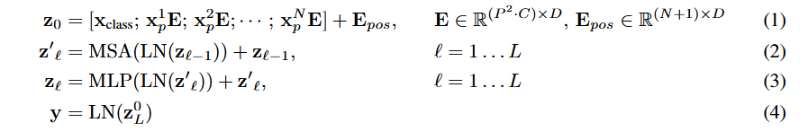

# 基本思想

## 1.图像输入（图像块的嵌入）

目标： 使二维图像能够被一维序列处理的 Transformer 模型理解。

**图像表示**： 原始图像 x 的分辨率是 `H（高度）× W（宽度），C（通道数，例如 RGB 的 3）`。

**图像分割（Patching）**： ViT 将图像分割成固定大小的 `(P, P)` 二维图像块（patches）。例如，一个 `16x16 `像素的图像块。

**数量计算**： 图像中总共会产生 N 个这样的图像块，其数量由图像尺寸和图像块尺寸决定，即 $N = (H × W) / (P^2)$。这个 N 的值非常关键，它决定了 Transformer 输入序列的有效长度。

**展平（Flattening）**： 每个 `(P, P)` 的二维图像块，其 $P^2$个像素（每个像素有 C 个通道值），被展平成一个长向量，其维度是 $P^2 × C$。

**序列形成**： 将所有 N 个展平后的图像块向量连接起来，形成一个一维的序列。这个序列的形状是 *$N × (P^2 × C)$*。

**线性投影（Linear Projection）**： Transformer 模型内部使用一个固定的潜在向量维度 D。因此，每个展平后的图像块向量（维度 $P^2 × C$）需要通过一个可训练的线性层映射到这个 D 维空间。这一步产生的输出被称为“图像块嵌入”（patch embeddings）。

>将每一个展平后的图像块向量（维度 P^2 × C）与这个权重矩阵 W_proj 相乘。
   如果设展平后的图像块向量为 v_patch (形状为 1 × (P^2 × C))，那么投影后的向量 v_embedding 的计算就是：v_embedding = v_patch × W_proj。
   结果 v_embedding 的形状就是 **1 × D**

序列长度： Transformer 模型接收的输入序列，其长度为 N（图像块的数量），每个元素的维度是 D（投影后的潜在维度）。

>经过这个线性投影得到的 D 维向量，就叫做 **“图像块嵌入”（patch embeddings）**。现在，你就有了 N 个维度为 D 的向量，这构成了一个 $N × D$ 的序列，可以被 Transformer 编码器接收和处理。

## 2.插入可学习的嵌入\[class]

 将图像分割成一系列图像块（patches）并进行线性嵌入（patch embeddings）后，
 会在这个序列的最前面添加一个额外的、可学习的嵌入向量，记作 **xclass**(表示Transformer编码器第0层的第0个元素，即 xclass）
 
 当这个**包含图像块嵌入和xclass嵌入的序列**通过整个Transformer编码器（共 L 层）处理后，xclass 对应的输出状态（记作 $z^L_0$）被认为是**整个图像的统一表示**，用于后续的分类任务。**它聚合了Transformer encoder中所有层对xclass词元的处理信息**

## 3.1D位置编码

## 4.流程公式

1. x_class: 这是一个可学习的、特殊的“分类 token”嵌入。它被添加到序列的开头，其最终在 Transformer 编码器中的输出表示将被用作整个图像的分类表示。这个设计灵感来源于 BERT  $x_p^i$: 表示原始图像被分割成的第 i 个图像块（patch) E: 这是一个可学习的线性投影矩阵（linear projection matrix),将展平后的图像块（其维度是 $P^2 * C$，其中 P 是每个图像块的边长，C 是图像通道数）映射到 Transformer 的隐藏层维度 **D**。所以，***$x_p^i E$ 是第 i 个图像块经过线性投影后的嵌入向量***
2. $z_{l-1}$​：代表第$l-1$ 层 Transformer 编码器的输出  **LN表示层归一化（Layer Normalization)**,在 ViT 中，层归一化通常应用在每个子层（MSA 和 MLP）的输入之前  MSA表示多头自注意力机制。它允许模型关注输入序列中不同位置（即不同的图像块）之间的关系，计算出每个图像块的加权表示 +：表示残差连接（Residual Connection),这是 Transformer 结构中的一个关键部分，它将子层（这里是 MSA）的输入$z_{l-1}$与其输出相加，有助于缓解深度网络中的梯度消失问题，并使模型更容易训练 
3. MLP层也是用LN与残差连接
4. $z^L_0$指的是在第 L层 Transformer 编码器输出序列中，对应于初始添加的 \[class] token 的那个向量。这个向量被认为聚合了整个图像的信息

## 5.归纳偏置

## 6.微调

为适应尺寸更大的图片，也就是说面临patch增大的情况，使用二维插值的方法，对patch进行位置编码

**具体实现**：
可以理解为将原有的 $N_{old}$个位置编码（从 $(H_{old}/P) \times (W_{old}/P)$ 网格）“拉伸”或“重新采样”到新的 ($H_{new}/P) \times (W_{new}/P)$ 网格中。如果新的网格点落在旧网格点之间，则通过**插值**（例如双线性插值 bilinear interpolation)来计算新的位置编码向量

## 7.Layer Normalization

