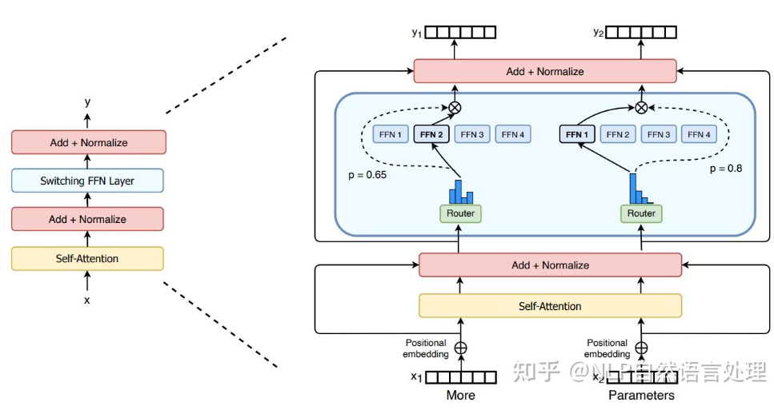

# 0.浅谈一下MoE

- Gate 为可学习的分类器，给每个专家一个概率
输入是当前 token 表示 x，输出是每个专家的分数：$g=softmax(Wx)$
- 选top-k ,加权输出$y=g2​⋅Expert2​(x)+g4​⋅Expert4​(x)$
- **没有人工标签告诉Gate该选谁，完全通过loss误差反向传播**


- x1,x2两个token，加positional embedding 进入self-attention

```python
 import torch
import torch.nn as nn
import torch.nn.functional as F

class MoE(nn.Module):
    def __init__(self, dim, hidden_dim, num_experts=4, capacity_factor=1.25):
        super().__init__()
        self.num_experts = num_experts
        self.capacity_factor = capacity_factor

        # 🔹 Gate（Router）
        self.gate = nn.Linear(dim, num_experts)

        # 🔹 Experts（多个 FFN）
        self.experts = nn.ModuleList([
            nn.Sequential(
                nn.Linear(dim, hidden_dim),
                nn.ReLU(),
                nn.Linear(hidden_dim, dim)
            ) for _ in range(num_experts)
        ])

    def forward(self, x):
        """
        x: [batch, seq_len, dim]
        """
        B, T, D = x.shape
        x_flat = x.reshape(-1, D)  # [N, D], N = B*T

        # ===== 1️⃣ Gate 打分 =====
        gate_logits = self.gate(x_flat)              # [N, E]
        gate_probs = F.softmax(gate_logits, dim=-1)  # 概率

        # ===== 2️⃣ Top-1 选择 =====
        top1_val, top1_idx = torch.max(gate_probs, dim=-1)  # [N]

        # ===== 3️⃣ capacity 限制 =====
        N = x_flat.shape[0]
        capacity = int((N / self.num_experts) * self.capacity_factor)

        # 用来存输出
        output = torch.zeros_like(x_flat)

        # ===== 4️⃣ 分发到各个专家 =====
        for i in range(self.num_experts):
            # 找到分配给第 i 个专家的 token
            idx = (top1_idx == i).nonzero(as_tuple=True)[0]

            if idx.numel() == 0:
                continue

            # 限制容量
            idx = idx[:capacity]

            # 取出对应 token
            x_i = x_flat[idx]

            # 过专家
            y_i = self.experts[i](x_i)

            # 按 gate 权重缩放
            y_i = y_i * top1_val[idx].unsqueeze(-1)

            # 写回
            output[idx] = y_i

        # reshape 回去
        output = output.reshape(B, T, D)

        return output
```

## 计算方式

```
所有 token 一起算 gate  
→ 一次性分组  
→ 每个专家并行处理一批 token

token按专家分组
专家0: 300个token  
专家1: 260个token  
专家2: 280个token

专家并行计算
for each expert:  
y_i = FFN_i(x_i)

```
# 1.POINT

- 为每个输入根据其场景复杂度动态分配计算资源

