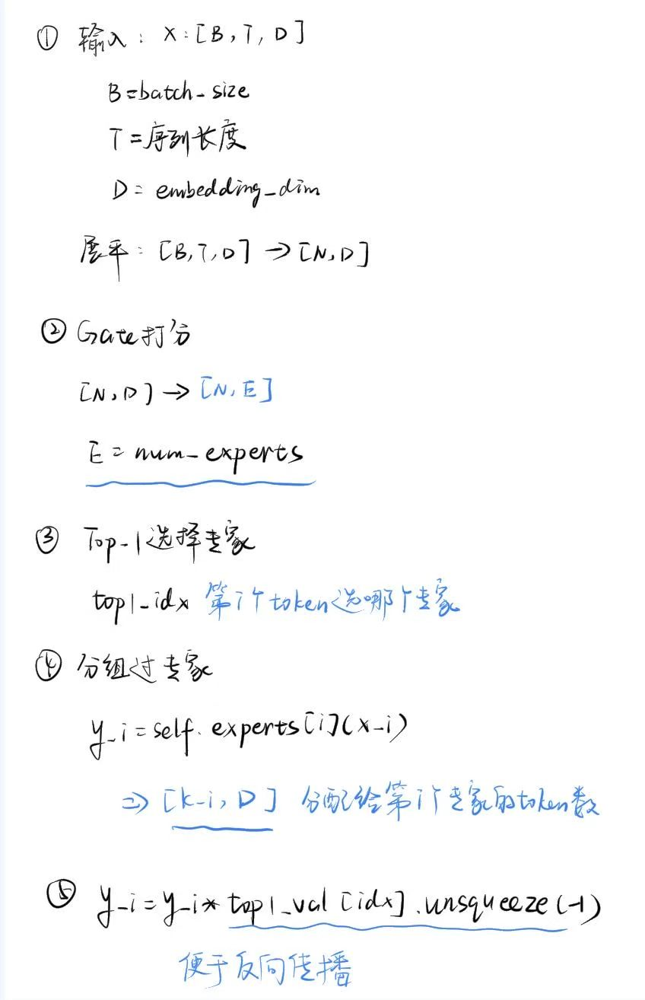
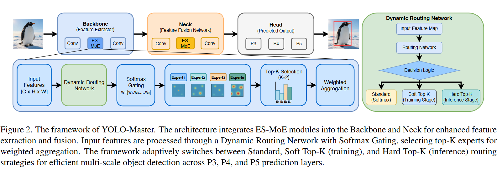

# 0.浅谈一下MoE

- Gate 为可学习的分类器，给每个专家一个概率
输入是当前 token 表示 x，输出是每个专家的分数：g=softmax(Wx)
- 选top-k ,加权输出y=g2​⋅Expert2​(x)+g4​⋅Expert4​(x)
- **没有人工标签告诉Gate该选谁，完全通过loss误差反向传播**


- x1,x2两个token，加positional embedding 进入self-attention

```python
 import torch
import torch.nn as nn
import torch.nn.functional as F

class MoE(nn.Module):
    def __init__(self, dim, hidden_dim, num_experts=4, capacity_factor=1.25):
        super().__init__()
        self.num_experts = num_experts
        self.capacity_factor = capacity_factor

        # 🔹 Gate（Router）
        self.gate = nn.Linear(dim, num_experts)

        # 🔹 Experts（多个 FFN）
        self.experts = nn.ModuleList([
            nn.Sequential(
                nn.Linear(dim, hidden_dim),
                nn.ReLU(),
                nn.Linear(hidden_dim, dim)
            ) for _ in range(num_experts)
        ])

    def forward(self, x):
        """
        x: [batch, seq_len, dim]
        """
        B, T, D = x.shape
        x_flat = x.reshape(-1, D)  # [N, D], N = B*T

        # ===== 1️⃣ Gate 打分 =====
        gate_logits = self.gate(x_flat)              # [N, E]
        gate_probs = F.softmax(gate_logits, dim=-1)  # 概率

        # ===== 2️⃣ Top-1 选择 =====
        top1_val, top1_idx = torch.max(gate_probs, dim=-1)  # [N]

        # ===== 3️⃣ capacity 限制 =====
        N = x_flat.shape[0]
        capacity = int((N / self.num_experts) * self.capacity_factor)

        # 用来存输出
        output = torch.zeros_like(x_flat)

        # ===== 4️⃣ 分发到各个专家 =====
        for i in range(self.num_experts):
            # 找到分配给第 i 个专家的 token
            idx = (top1_idx == i).nonzero(as_tuple=True)[0]

            if idx.numel() == 0:
                continue

            # 限制容量
            idx = idx[:capacity]

            # 取出对应 token
            x_i = x_flat[idx]

            # 过专家
            y_i = self.experts[i](x_i)

            # 按 gate 权重缩放
            y_i = y_i * top1_val[idx].unsqueeze(-1)

            # 写回
            output[idx] = y_i

        # reshape 回去
        output = output.reshape(B, T, D)

        return output
```

## 计算方式

```
所有 token 一起算 gate  
→ 一次性分组  
→ 每个专家并行处理一批 token

token按专家分组
专家0: 300个token  
专家1: 260个token  
专家2: 280个token

专家并行计算
for each expert:  
y_i = FFN_i(x_i)

```

# 1.POINT

- 为每个输入根据其场景复杂度动态分配计算资源
- 一个轻量级动态路由网络在训练过程中，通过一个提升多样性的目标，指导专家专业化，鼓励专家之间互补的专业知识 **也就是让专家分化**
- 设计实现了计算资源的动态分配，其分配依据是输入特征的局部特性与复杂度

# 2.主要思想


 1. Backbone负责特征提取。图中显示 ES-MoE 被插入其中，用于在提取阶段根据目标的尺度和场景复杂度动态增强特征;<br> Neck负责特征融合（如 P3、P4、P5 层),在这里，ES-MoE 能够实现自适应的多尺度信息精炼<br> Head最终的输出层，用于预测物体的类别和边界框
 
 2. **ES-MoE**<br> Input Feature:输入特征图<br> Dynamic Routing Network:动态路由网络，它决定了哪些“专家”应该被激活<br> Softmax Gating:通过 Softmax 函数计算每个专家的权重<br> Expert Group:一组独立的子网络。每个专家使用不同卷积核大小（如 3x3, 5x5, 7x7）的    Depthwise Separable Convolution (DWconv)，以覆盖不同的感受野<br> Top-K Selection (K=2): 从n个专家中只选出权重最高的2个,这种稀疏激活机制是保持实时性的关键。<br> Weighted Aggregation: 将选定专家的输出进行加权融合
 
 3. 分阶段路由策略<br> 为了平衡训练效果和推理速度，Dynamic Routing Network 采用了不同的决策逻辑：
- Soft Top-K (训练阶段): 保持所有专家的梯度流。即使只有 Top-K 专家起主要作用，其他专家也能获得更新，防止“专家崩溃”（即某些专家从未被训练）。
- Hard Top-K (推理阶段): 严格只运行选中的K 专家。这在硬件部署时能显著减少计算量（FLOPs）并降低延迟。
- Standard (Softmax): 基础的全量加权模式。

**YOLO-Master 通过这种设计打破了传统 YOLO 的“静态密集计算”限制。简单场景下它可能激活较小的卷积专家，而复杂场景下则调用感受野更大的专家，从而在不增加平均延迟的前提下提升了检测精度，特别是在密集小目标场景（如 VisDrone 数据集）中表现优异。**

 