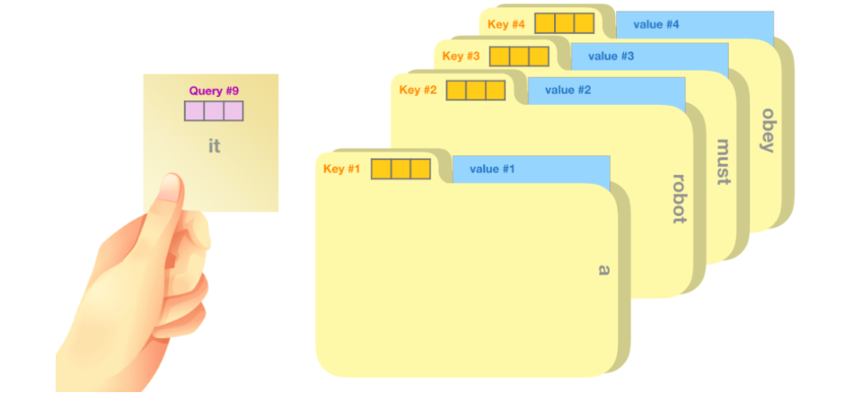
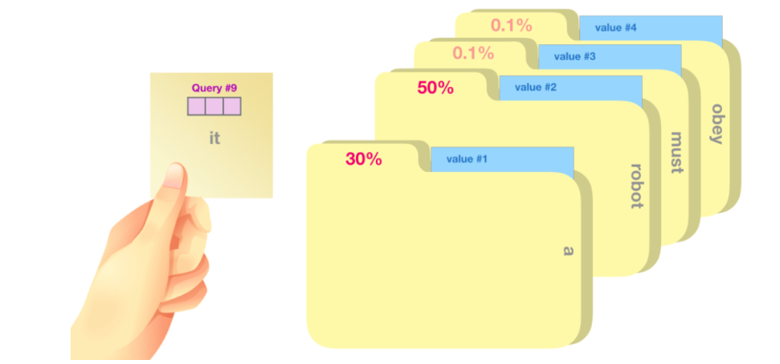
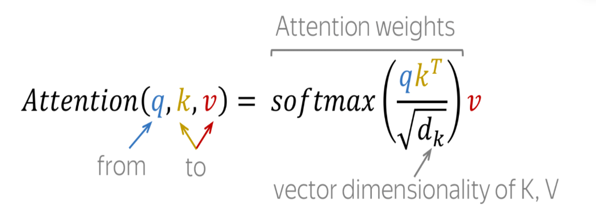
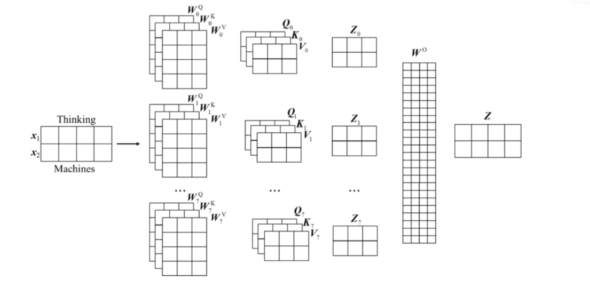

# cnn中的归纳偏置

1. 局部性
CNN 的卷积核被设计成只在图像的一个**局部感受野**内进行计算。这意味着每一层的神经元只接收其输入局部区域的信息
2. 权重共享
 CNN 在整个输入图像（或特征图）上重复使用相同的卷积核权重。一个卷积核被训练来检测特定的局部特征，无论它在输入中的哪个位置，一个卷积核在图像所有局部区域上滑动并执行相同的计算
 - 减少参数量
 - 不易过拟合
3. 平移不变性
4. 空间层级性
 CNN 通过堆叠多个卷积层来构建一个特征学习的层级结构。较低层学习简单的、低级的特征（如边缘、颜色斑块），而较高层则将这些低级特征组合成更复杂、更抽象的高级特征（如纹理、形状、物体部件，直到整个物体），这反映了视觉信息处理的自然层级结构。
# 自注意力机制&Transformer算法

[自注意力机制&Transformer算法 – 图神经网络公社](http://gnn.club/?p=1992)
self-attention的一个粗略的类比是将其想象为在文件柜中搜索。查询向量𝑞就像一张便签纸，上面写着您正在研究的主题。𝑘向量就像柜子内文件夹的标签。当你将标签与便签匹配时，我们取出该文件夹的内容，这些内容就是值向量𝑣。

每个文件夹的权重分数是通过查询向量与正在评分的相应单词的键向量的点积计算得出的。点积的公式： 𝑎 ×𝑏 =|𝑎| ×|𝑏| ×cos⁡𝜃 。其意义就是比较两个向量的相关程度，相关性越高，分数越大。注意，点积后需要对结果进行softmax映射得到权重分数，Softmax映射后的分数决定了每个词在句子中某个位置的重要性。

## 公式

（1）计算 𝑄 和 𝐾 之间的相似度，即 $QK^T$ 。

（2）由于 𝑄 和 𝐾 的维度可能很大, 因此需要将其除以√𝑑𝑘 来缩放。这有助于避免在 Softmax 计算时出现梯度消失或梯度爆炸的问题。

（3）对相似度矩阵进行 Softmax 操作, 得到每个查间向量与所有键向量的权重分布。然后, 将这些权重与值矩阵 𝑉 相乘并相加, 得到自注意力机制的输出矩阵。

## 多头自注意力

 

## 什么时候需要编码器-解码器，什么时候可以只使用编码器或解码器？

-  Encoder：理解输入（source）
- Decoder：逐步生成输出（target）

### 1.**什么时候只用「编码器」（Encoder-only）**

**只需要“理解”，不需要生成新序列**

- 文本分类（情感分析）
- 句子匹配（相似度）
- 命名实体识别（NER）
- 图文对齐
- 
典型代表：
- BERT
- Vision Transformer
- CLIP

### 2.**什么时候用「编码器-解码器」（Encoder–Decoder）**

**输入和输出是“两种序列”，且需要对齐/转换**

- 机器翻译  （英文 → 中文）
- 图像描述（Image Captioning）  （图像 → 句子）
- 语音识别  （语音 → 文本）
- 多模态生成 

### 3.**什么时候只用「解码器」（Decoder-only）**

**任务：从已有上下文“往后生成”**

- 文本生成（GPT类）
- 对话系统
- 代码生成
- 续写、补全
