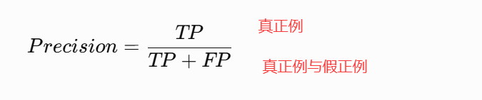
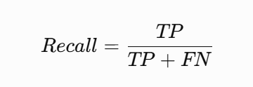

### 上采样与下采样

1. **下采样**指的是把图像或特征图的空间尺寸变小：
    - 减少计算量
    - 扩大感受野
    - 提取更抽象、更高级的语义特征
    - 压缩空间信息
常见方法：池化 步长卷积
2. **上采样**指的是把图像或特征图的空间尺寸变大：
    - -恢复空间分辨率
      - 生成高分辨率输出
      - 图像分割中恢复像素级预测
      - 图像重建、超分辨率、生成模型
  常见方法：转置卷积 
### **Depthwise Conv** 与 SE
**Depthwise Conv**: 逐通道卷积，对每个输入通道单独做卷积，只提取空间特征，不混合不用通道的信息
**SE:**
- squeeze:
   - 操作：利用全域平均池化
   - 目的：卷积层通常只关注局部视野，而 Squeeze 将空间维度压缩为1\*1，把整个通道的全局信息“挤压”成一个实数。这代表了该通道特征的全局统计分布。
- Excitation（激励）：
   - 操作：通过两个全连接层（FC）和一个激活函数
   - 目的：模型通过学习产生一个 0到 1 之间的权重值
   权重重分配：**将这个权重乘回原始特征图**，如果某个通道提取的是对分类宫颈癌（如低分化细胞核形态）至关重要的特征，SE 层会赋予其更高的权重；反之则降低权重。
### 常见指标

1. Accuracy:

2. Precision:
在医学图像中：模型判断为“有肿瘤”的病例中，**真正有肿瘤的比例,Precision 越高**，说明误报越少
3. Recall:
 
 所有真实正类样本中，模型成功找出了多少
4. F1:精确率和召回率的调和平均值

